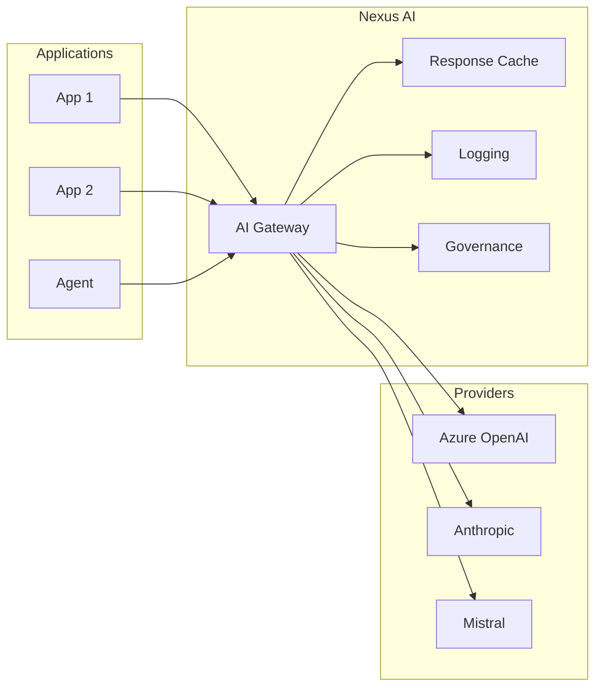
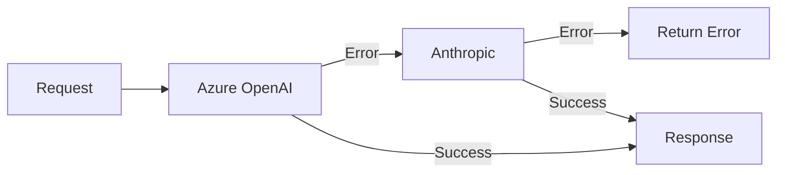

# Model Access

<p style="font-size: 1.1em; color: #666; margin-bottom: 2em;">
Unified AI Gateway for all LLMs.
</p>

---

## Objective

Model Access simplifies access to AI models by providing:

- **AI Gateway**: A single URL for all providers
- **No API key**: Authentication via Nexus token
- **Observability**: Logging, metrics, traces
- **Governance**: Quotas, budgets, compliance

---

## Architecture



---

## Capabilities

- **Centralized API gateway** with authentication & authorization
- **Multi-tenant cost tracking** and spend management per project/user
- **Per-project customization** (logging, guardrails, caching)
- **Virtual keys** for secure access control
- **Admin dashboard UI** for monitoring and management
- **100+ providers** supported with OpenAI-compatible API
- **Built-in caching** and load balancing

---

## Solution Comparison

| Criteria | LiteLLM | Portkey | Helicone | OpenRouter |
|----------|---------|---------|----------|------------|
| **Type** | Open Source | Commercial | Open Source | SaaS |
| **Self-hosted** | Yes | Yes (Enterprise) | Yes | No |
| **License** | MIT | Proprietary | MIT | N/A |
| **Providers** | 100+ | 1600+ | 100+ | 500+ |
| **OpenAI Compatible** | Yes | Yes | Yes | Yes |
| **Latency overhead** | ~8ms P95 | <10ms | ~8ms P50 | ~15ms |
| **Caching** | Yes | Yes | Yes (95% savings) | No |
| **Load balancing** | Yes | Yes | Yes | Yes |
| **Fallback/Retry** | Yes | Yes | Yes | Yes |
| **Cost tracking** | Yes | Yes | Yes | Yes |
| **Guardrails** | Yes (plugins) | Yes (50+ built-in) | Yes | No |
| **PII redaction** | Yes (Presidio) | Yes | Yes | No |
| **Admin UI** | Yes | Yes | Yes | No |
| **SOC 2** | No | Yes (Type 2) | Yes | Yes (Type 1) |
| **GDPR** | Self-managed | Yes | Yes | Partial |
| **Pricing** | Free (OSS) / Enterprise license | Free → $49/mo → Custom | Free (10k req) → $79/mo → $799/mo | 5.5% fee (pay-as-you-go) |

### Recommendation

For **self-hosted enterprise deployments** with strict data residency requirements:

- **LiteLLM**: Best open-source option, full control, MIT license, active community
- **Helicone**: Best for observability-first approach, Rust-based performance

For **managed/hybrid deployments**:

- **Portkey**: Best enterprise features (governance, compliance, guardrails)
- **OpenRouter**: Best for rapid prototyping (no self-hosting needed)

---

## Usage

### Endpoint

```
https://nexus.internal/ai/v1
```

### With the Nexus SDK

```python
from nexus.ai import NexusAI

ai = NexusAI()

# Chat completion
response = ai.chat.completions.create(
    model="gpt-4o",
    messages=[
        {"role": "system", "content": "You are a helpful assistant."},
        {"role": "user", "content": "Explain microservices."}
    ],
    temperature=0.7,
    max_tokens=1000
)

print(response.choices[0].message.content)
```

### With the OpenAI SDK (compatible)

```python
from openai import OpenAI

# Point to Nexus instead of OpenAI
client = OpenAI(
    base_url="https://nexus.internal/ai/v1",
    api_key="unused"  # Auth is done via NEXUS_TOKEN
)

response = client.chat.completions.create(
    model="gpt-4o",
    messages=[{"role": "user", "content": "Hello!"}]
)
```

### Streaming

```python
# Streaming response
stream = ai.chat.completions.create(
    model="gpt-4o",
    messages=[{"role": "user", "content": "Write a story."}],
    stream=True
)

for chunk in stream:
    if chunk.choices[0].delta.content:
        print(chunk.choices[0].delta.content, end="")
```

---

## Available models

### Production

| Nexus Alias | Provider | Actual model | Use case |
|-------------|----------|-------------|----------|
| `gpt-4o` | Azure OpenAI | gpt-4o-2024-08-06 | General |
| `gpt-4-turbo` | Azure OpenAI | gpt-4-turbo-2024-04-09 | Long context |
| `gpt-3.5-turbo` | Azure OpenAI | gpt-35-turbo-0125 | Cost optimized |
| `claude-3-opus` | Anthropic | claude-3-opus-20240229 | Analysis |
| `claude-3-sonnet` | Anthropic | claude-3-5-sonnet-20241022 | Balance |
| `claude-3-haiku` | Anthropic | claude-3-haiku-20240307 | Fast |
| `mistral-large` | Mistral | mistral-large-latest | EU compliant |

### Use a specific model

```python
# Via alias (recommended)
response = ai.chat.completions.create(
    model="gpt-4o",
    messages=[...]
)

# Via provider full name
response = ai.chat.completions.create(
    model="azure/gpt-4o-2024-08-06",
    messages=[...]
)
```

---

## Advanced features

### Function Calling

```python
response = ai.chat.completions.create(
    model="gpt-4o",
    messages=[{"role": "user", "content": "What's the weather in Paris?"}],
    tools=[{
        "type": "function",
        "function": {
            "name": "get_weather",
            "description": "Get weather for a location",
            "parameters": {
                "type": "object",
                "properties": {
                    "location": {"type": "string"}
                },
                "required": ["location"]
            }
        }
    }]
)
```

### Vision

```python
response = ai.chat.completions.create(
    model="gpt-4o",
    messages=[{
        "role": "user",
        "content": [
            {"type": "text", "text": "What's in this image?"},
            {"type": "image_url", "image_url": {"url": "https://..."}}
        ]
    }]
)
```

### Embeddings

```python
response = ai.embeddings.create(
    model="text-embedding-3-small",
    input=["Hello world", "Goodbye world"]
)

vectors = [e.embedding for e in response.data]
```

---

## Caching

Identical responses are cached automatically:

```python
# First request: call to provider
response1 = ai.chat.completions.create(
    model="gpt-4o",
    messages=[{"role": "user", "content": "What is 2+2?"}]
)
# Latency: ~800ms, tokens billed

# Same request: cache hit
response2 = ai.chat.completions.create(
    model="gpt-4o",
    messages=[{"role": "user", "content": "What is 2+2?"}]
)
# Latency: ~5ms, no tokens billed
```

### Control caching

```python
# Disable cache for this request
response = ai.chat.completions.create(
    model="gpt-4o",
    messages=[...],
    extra_headers={"X-Nexus-Cache": "skip"}
)
```

---

## Observability

### Exposed metrics

| Metric | Description |
|----------|-------------|
| `nexus_ai_requests_total` | Number of requests per model |
| `nexus_ai_tokens_total` | Tokens consumed (input/output) |
| `nexus_ai_latency_seconds` | Request latency |
| `nexus_ai_errors_total` | Errors by type |
| `nexus_ai_cache_hits_total` | Cache hits |

### Grafana Dashboard

A pre-configured dashboard is available:

- Requests by team/application
- Real-time costs
- Latency P50/P95/P99
- Top used models
- Errors and rate limits

---

## Fallback and retry

The gateway automatically handles:

- **Retry**: 3 attempts on 5xx errors
- **Fallback**: Switch to backup provider if unavailable
- **Rate limiting**: Queue and automatic backoff


