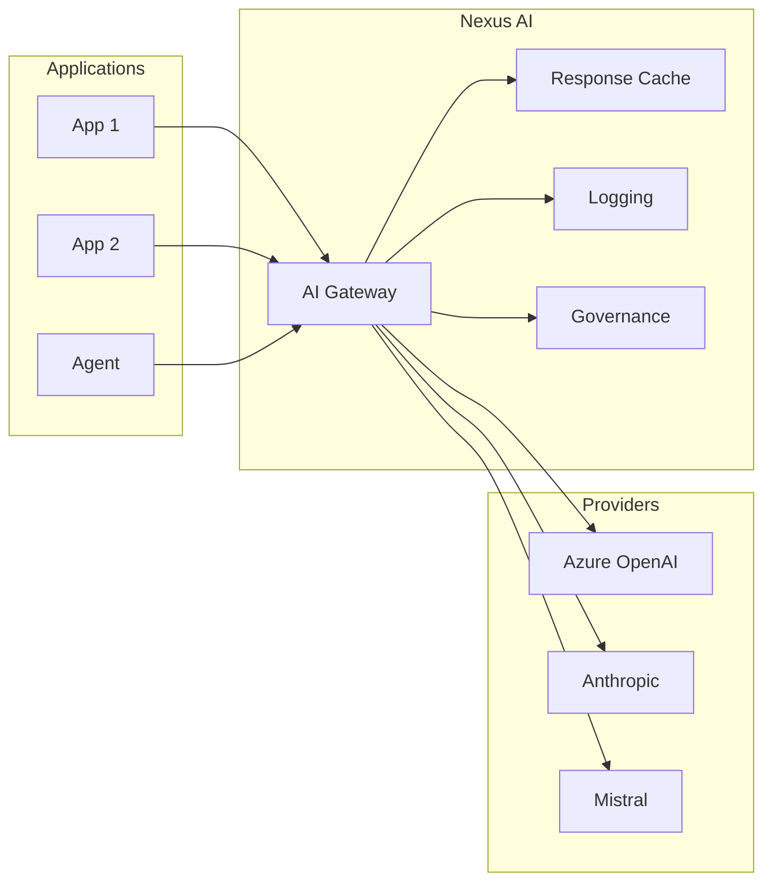

# Model Access

<p style="font-size: 1.1em; color: #666; margin-bottom: 2em;">
Unified AI Gateway for all LLMs.
</p>

---

## Objective

Model Access simplifies access to AI models by providing:

- **AI Gateway**: A single URL for all providers
- **No API key**: Authentication via Nexus token
- **Observability**: Logging, metrics, traces
- **Governance**: Quotas, budgets, compliance

---

## Architecture



---

## Capabilities

- **Centralized API gateway** with authentication & authorization
- **Multi-tenant cost tracking** and spend management per project/user
- **Per-project customization** (logging, guardrails, caching)
- **Virtual keys** for secure access control
- **Admin dashboard UI** for monitoring and management
- **100+ providers** supported with OpenAI-compatible API
- **Built-in caching** and load balancing

---

## Solution Comparison

| Criteria | LiteLLM | Portkey | Helicone | OpenRouter |
|----------|---------|---------|----------|------------|
| **Type** | Open Source | Commercial | Open Source | SaaS |
| **Self-hosted** | Yes | Yes (Enterprise) | Yes | No |
| **License** | MIT | Proprietary | MIT | N/A |
| **Providers** | 100+ | 1600+ | 100+ | 500+ |
| **OpenAI Compatible** | Yes | Yes | Yes | Yes |
| **Latency overhead** | ~8ms P95 | <10ms | ~8ms P50 | ~15ms |
| **Caching** | Yes | Yes | Yes (95% savings) | No |
| **Load balancing** | Yes | Yes | Yes | Yes |
| **Fallback/Retry** | Yes | Yes | Yes | Yes |
| **Cost tracking** | Yes | Yes | Yes | Yes |
| **Guardrails** | Yes (plugins) | Yes (50+ built-in) | Yes | No |
| **PII redaction** | Yes (Presidio) | Yes | Yes | No |
| **Admin UI** | Yes | Yes | Yes | No |
| **SOC 2** | No | Yes (Type 2) | Yes | Yes (Type 1) |
| **GDPR** | Self-managed | Yes | Yes | Partial |
| **Pricing** | Free (OSS) / Enterprise license | Free → $49/mo → Custom | Free (10k req) → $79/mo → $799/mo | 5.5% fee (pay-as-you-go) |

### Recommendation

For **self-hosted enterprise deployments** with strict data residency requirements:

- **LiteLLM**: Best open-source option, full control, MIT license, active community
- **Helicone**: Best for observability-first approach, Rust-based performance

For **managed/hybrid deployments**:

- **Portkey**: Best enterprise features (governance, compliance, guardrails)
- **OpenRouter**: Best for rapid prototyping (no self-hosting needed)

---

## Usage

The AI Gateway exposes an **OpenAI-compatible API**. Use any OpenAI SDK or HTTP client:

```python
from openai import OpenAI

client = OpenAI(
    base_url="https://nexus.cegid.com/ai/v1",
    api_key=os.environ["NEXUS_TOKEN"]
)

response = client.chat.completions.create(
    model="gpt-4o",
    messages=[{"role": "user", "content": "Hello!"}]
)
```

All standard features are supported: streaming, function calling, vision, embeddings.

---

## Available Models

| Alias | Provider | Use case |
|-------|----------|----------|
| `gpt-4o` | Azure OpenAI | General purpose |
| `gpt-4-turbo` | Azure OpenAI | Long context |
| `gpt-3.5-turbo` | Azure OpenAI | Cost optimized |
| `claude-3-opus` | Anthropic | Deep analysis |
| `claude-3-sonnet` | Anthropic | Balanced |
| `claude-3-haiku` | Anthropic | Fast & cheap |
| `mistral-large` | Mistral | EU compliant |

---

## Gateway Features

The AI Gateway handles automatically:

| Feature | Description |
|---------|-------------|
| **Caching** | Identical requests cached, ~95% cost savings |
| **Retry** | 3 attempts on 5xx errors |
| **Fallback** | Switch to backup provider if unavailable |
| **Rate limiting** | Queue and automatic backoff |
| **Observability** | Metrics, logs, traces per team/app |
| **Cost tracking** | Real-time spend per project |
