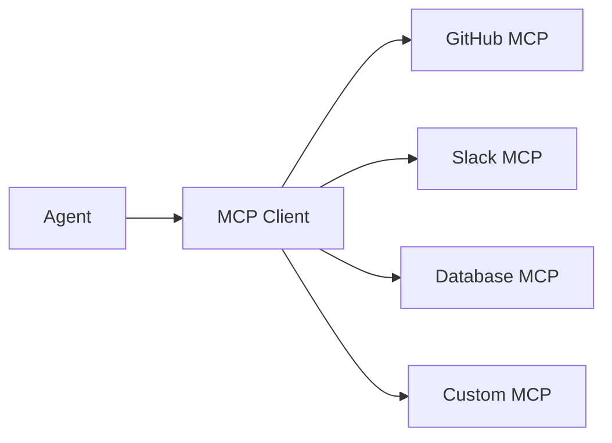

# MCP Ecosystem

<p style="font-size: 1.1em; color: #666; margin-bottom: 2em;">
Catalog of MCP servers to extend your agents' capabilities.
</p>

---

## What is MCP?

**Model Context Protocol (MCP)** is a standard protocol for connecting LLMs to external data sources and tools. Nexus maintains a catalog of ready-to-use MCP servers.



---

## Catalog

### Official servers

| Server | Description | Capabilities |
|---------|-------------|--------------|
| `github` | GitHub integration | repos, issues, PRs, search |
| `slack` | Slack integration | messages, channels, users |
| `jira` | Jira integration | issues, projects, search |
| `confluence` | Confluence integration | pages, spaces, search |
| `postgres` | PostgreSQL database | query, schema |
| `filesystem` | Filesystem access | read, write, list |

### Internal servers

| Server | Description | Owner |
|---------|-------------|-------|
| `nexus-docs` | Nexus documentation | Platform |
| `company-wiki` | Internal wiki | Knowledge |
| `hr-system` | HR system | HR |
| `crm` | Internal CRM | Sales |

### Explore the catalog

```bash
# List available servers
nexus mcp list

# Server details
nexus mcp info github

# Search
nexus mcp search "database"
```

---

## Usage

### In an agent

```python
from nexus.ai.agents import Agent
from nexus.ai.mcp import MCPClient

class MyAgent(Agent):
    def __init__(self):
        super().__init__()
        # Connect to MCP servers
        self.github = MCPClient("github")
        self.slack = MCPClient("slack")

    @tool
    def search_github(self, query: str) -> str:
        """Search in GitHub repos."""
        return self.github.call("search_repositories", query=query)

    @tool
    def send_slack(self, channel: str, message: str) -> str:
        """Send a Slack message."""
        return self.slack.call("send_message",
            channel=channel,
            text=message
        )
```

---

## GitHub Server

### Capabilities

| Tool | Description |
|------|-------------|
| `search_repositories` | Search repos |
| `get_repository` | Repo details |
| `list_issues` | List issues |
| `create_issue` | Create an issue |
| `get_pull_request` | PR details |
| `list_commits` | Commit history |

### Example

```python
# Search repos
repos = github.call("search_repositories",
    query="language:python stars:>100"
)

# Create an issue
issue = github.call("create_issue",
    repo="org/my-repo",
    title="Bug report",
    body="Bug description..."
)

# List open PRs
prs = github.call("list_pull_requests",
    repo="org/my-repo",
    state="open"
)
```

---

## Slack Server

### Capabilities

| Tool | Description |
|------|-------------|
| `send_message` | Send a message |
| `list_channels` | List channels |
| `search_messages` | Search in messages |
| `get_user` | User info |
| `create_channel` | Create a channel |

### Example

```python
# Send a message
slack.call("send_message",
    channel="#platform-alerts",
    text="New deployment completed"
)

# Search messages
results = slack.call("search_messages",
    query="deployment error",
    count=10
)
```

---

## PostgreSQL Server

### Capabilities

| Tool | Description |
|------|-------------|
| `query` | Execute a SQL query |
| `get_schema` | Get the schema |
| `list_tables` | List tables |
| `describe_table` | Describe a table |

### Example

```python
# SQL query (read-only by default)
results = postgres.call("query",
    sql="SELECT * FROM users WHERE created_at > '2025-01-01'"
)

# Get schema
schema = postgres.call("get_schema")

# Describe a table
table_info = postgres.call("describe_table", table="users")
```

### Security

By default, only SELECT queries are allowed. Write access requires explicit configuration and approval.

---

## Create an MCP Server

### Structure

```
my-mcp-server/
├── server.py        # Server code
├── config.yaml      # Configuration
├── Dockerfile
└── README.md
```

### Code

```python
# server.py
from nexus.mcp import MCPServer, tool

server = MCPServer("my-custom-mcp")

@server.tool
def get_data(id: str) -> dict:
    """Retrieve data by ID."""
    # Your logic here
    return {"id": id, "data": "..."}

@server.tool
def process_data(input: str) -> str:
    """Process data."""
    return f"Processed: {input}"

if __name__ == "__main__":
    server.run()
```

### Deploy

```bash
# Deploy the MCP server
nexus mcp deploy my-custom-mcp

# Publish to the catalog (internal)
nexus mcp publish my-custom-mcp \
  --description "My custom MCP server" \
  --tags internal,data
```

---

## Security

### Authentication

Each MCP server can use different auth types:

| Type | Description |
|------|-------------|
| `none` | No auth (development) |
| `api_key` | Simple API key |
| `oauth` | OAuth2 flow |
| `service_account` | Nexus service account |

### Audit

All MCP requests are logged:

```bash
# View MCP audit logs
nexus mcp audit --server github --since 24h
```

---

## Best practices

!!! tip "Caching"

    Enable caching for frequent requests to improve performance and reduce external API calls.

!!! warning "Rate limiting"

    Configure limits to avoid saturating external services.

!!! danger "Sensitive data"

    Never expose credentials in logs. Enable sensitive data masking.
