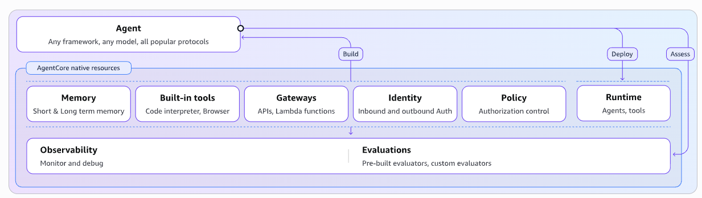
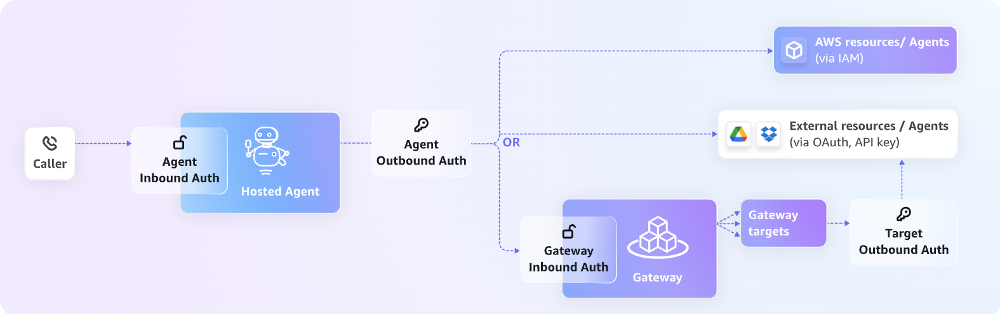

# Agent Hosting & Agent SDK

<p style="font-size: 1.1em; color: #666; margin-bottom: 2em;">
Build agents with your preferred framework, deploy them on managed infrastructure.
</p>

!!! warning "Implementation Status"

    Agent Hosting will be based on **Cegid Pulse OS Custom Orchestration**. The detailed implementation is currently being defined.

!!! info "Collaboration"

    This section should be built jointly with the **Pulse OS team** to benefit from their experience on the subject.

---

## Overview

Agent Hosting provides a managed execution environment purpose-built for AI agents. Unlike raw serverless functions (Lambda, Azure Functions), agent-native platforms offer critical advantages for agentic workloads.



### Why not Lambda / Azure Functions?

Traditional serverless functions are designed for short, stateless executions. AI agents have fundamentally different requirements:

| Challenge | Lambda / Azure Functions | Agent-Native Platform |
|-----------|--------------------------|----------------------|
| **Session duration** | Max 15 min timeout | Up to 8 hours for async workloads |
| **I/O wait costs** | Pay for idle time (30-70% of agent runtime) | Pay only for active compute |
| **Session isolation** | Shared execution contexts | Complete microVM isolation per session |
| **Memory & state** | Stateless by design | Built-in short & long-term memory |
| **Agent-specific tools** | Build from scratch | Code interpreter, browser, built-in tools |
| **Policy & guardrails** | Manual implementation | Natural language policy definitions |

### Platform capabilities

The Nexus Agent Hosting platform provides:

- **Memory**: Short & long-term memory for conversation continuity
- **Built-in tools**: Code interpreter, browser, pre-integrated capabilities
- **Gateways**: API and Lambda function integration as MCP servers
- **Identity**: Inbound and outbound authentication
- **Policy**: Authorization control with natural language rules
- **Runtime**: Secure, isolated agent execution
- **Observability**: Monitor and debug agent behavior
- **Evaluations**: Pre-built and custom evaluators

### Cloud providers

The primary implementation is based on **Amazon Bedrock AgentCore**: [aws.amazon.com/bedrock/agentcore](https://aws.amazon.com/bedrock/agentcore/)

!!! info "Azure alternative"
    A similar solution could be envisioned on Azure using [Azure AI Foundry Agent Service](https://azure.microsoft.com/en-us/products/ai-foundry/agent-service).

---

## Identity & Authentication

Agents need secure identity for both inbound (who can call the agent) and outbound (what the agent can access) authentication.



| Flow | Description |
|------|-------------|
| **Inbound Auth** | Validates caller identity before agent execution |
| **Outbound Auth (Direct)** | Agent accesses AWS resources via IAM, or external APIs via OAuth/API keys |
| **Outbound Auth (Gateway)** | Agent calls through a managed gateway with its own auth layer |

---

## Agent SDK

### Use any framework

Nexus doesn't impose an agent framework. Use the one that fits your needs:

- [LangGraph](https://langchain-ai.github.io/langgraph/) — Graph-based orchestration
- [OpenAI Agents SDK](https://openai.github.io/openai-agents-python/) — OpenAI-native
- [Google ADK](https://google.github.io/adk-docs/) — Gemini-native
- [CrewAI](https://docs.crewai.com/) — Multi-agent teams
- [Anthropic Claude SDK](https://docs.anthropic.com/en/docs/agents) — Claude-native

### What Nexus provides

When you deploy an agent on Nexus, the platform handles:

| Capability | Description |
|------------|-------------|
| **Identity** | Automatic service account and JWT tokens |
| **AI Gateway** | Model access with quotas and audit |
| **Observability** | Tracing, metrics, logs (OpenTelemetry) |

---

## Deployment

### Via CLI

```bash
# Deploy an agent
nexus ai agent deploy my-agent --env production

# With options
nexus ai agent deploy my-agent \
  --env production \
  --replicas 3 \
  --cpu 1000m \
  --memory 1Gi
```

### Environments

| Environment | Description | Scaling |
|---------------|-------------|---------|
| `development` | Local tests | 1 replica |
| `staging` | Pre-production | 1-3 replicas |
| `production` | Production | 2-10 replicas |

---

## Execution modes

### Synchronous (HTTP)

The agent responds directly via HTTP:

```python
# Endpoint: POST /agents/my-agent/run
{
    "input": "Analyze this document",
    "context": {"user_id": "123"}
}

# Response
{
    "output": "The analysis shows that...",
    "metadata": {"tokens_used": 1234}
}
```

### Asynchronous (Queue)

For long-running tasks:

```python
# Submit a task
response = client.agents.submit(
    "my-agent",
    input="Generate a complete report",
    webhook="https://my-service/callback"
)
# {"task_id": "task_abc123", "status": "pending"}

# Check status
status = client.agents.status("task_abc123")
# {"status": "running", "progress": 45}

# Or receive the webhook when complete
```

### Streaming

For real-time responses:

```python
stream = client.agents.stream(
    "my-agent",
    input="Explain quantum physics to me"
)

for chunk in stream:
    print(chunk.text, end="")
```

---

## Observability

### Logs

```bash
# View logs
nexus ai agent logs my-agent

# Follow in real-time
nexus ai agent logs my-agent --follow

# Filter
nexus ai agent logs my-agent --level error --since 1h
```

### Metrics

Automatically exposed metrics:

| Metric | Description |
|----------|-------------|
| `agent_requests_total` | Number of requests |
| `agent_latency_seconds` | Response latency |
| `agent_tokens_total` | LLM tokens consumed |
| `agent_errors_total` | Number of errors |
| `agent_queue_size` | Pending tasks |

### Traces

Distributed tracing with OpenTelemetry:

```python
from nexus.ai.agents import Agent
from opentelemetry import trace

class MyAgent(Agent):
    async def process(self, input: str):
        tracer = trace.get_tracer(__name__)

        with tracer.start_as_current_span("process_input"):
            # Your code
            result = await self.llm.generate(input)

        return result
```

---

## Scaling

### Manual scaling

```bash
# Immediate scaling
nexus ai agent scale my-agent --replicas 5

# Enable/disable auto-scaling
nexus ai agent scale my-agent --autoscale on
nexus ai agent scale my-agent --autoscale off
```

---

## Secrets

### Add a secret

```bash
# Add a secret
nexus ai agent secret set my-agent EXTERNAL_API_KEY "sk-..."

# List secrets
nexus ai agent secret list my-agent

# Delete
nexus ai agent secret delete my-agent EXTERNAL_API_KEY
```

### Use in code

```python
import os

class MyAgent(Agent):
    def __init__(self):
        # Secrets are injected as environment variables
        self.api_key = os.environ["EXTERNAL_API_KEY"]
```

---

## Rollback

```bash
# View deployment history
nexus ai agent history my-agent

# Rollback to previous version
nexus ai agent rollback my-agent

# Rollback to a specific version
nexus ai agent rollback my-agent --version 1.2.3
```

