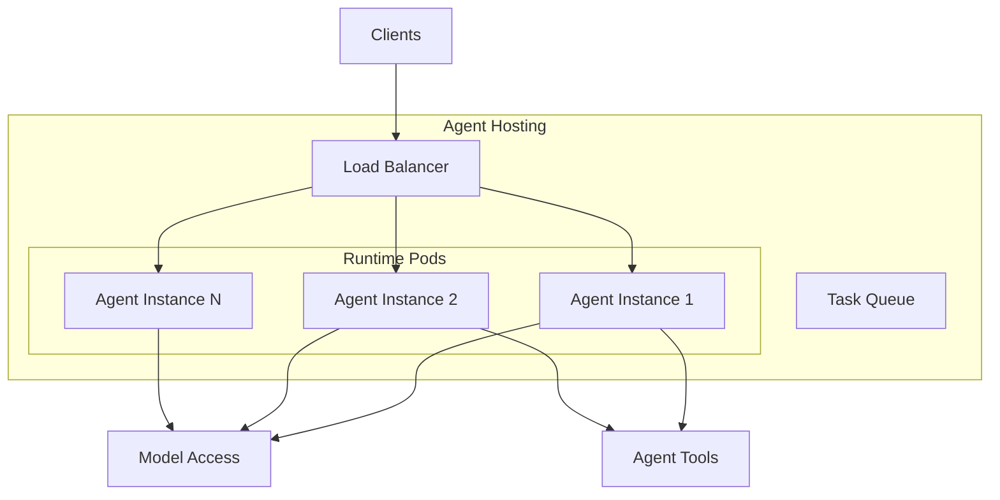

# Agent Hosting

<p style="font-size: 1.1em; color: #666; margin-bottom: 2em;">
Managed runtime to run your AI agents in production.
</p>

!!! warning "Implementation Status"

    Agent Hosting will be based on **Cegid Pulse OS Custom Orchestration**. The detailed implementation is currently being defined.

---

## Overview

Agent Hosting provides an execution environment for your agents, based on the Pulse infrastructure. It handles:

- **Deployment**: Built-in CI/CD
- **Scaling**: Auto-scaling based on load
- **Observability**: Logs, metrics, traces
- **Security**: Isolation, secrets management



---

## Deployment

### Via CLI

```bash
# Deploy an agent
nexus ai agent deploy my-agent --env production

# With options
nexus ai agent deploy my-agent \
  --env production \
  --replicas 3 \
  --cpu 1000m \
  --memory 1Gi
```

### Via GitOps

Add a GitHub Actions workflow:

```yaml
# .github/workflows/deploy.yml
name: Deploy Agent

on:
  push:
    branches: [main]

jobs:
  deploy:
    runs-on: ubuntu-latest
    steps:
      - uses: actions/checkout@v4

      - name: Deploy to Nexus
        uses: nexus/agent-deploy@v1
        with:
          agent: my-agent
          environment: production
          token: ${{ secrets.NEXUS_TOKEN }}
```

---

## Configuration

### config.yaml

```yaml
# config.yaml
name: my-agent
version: 1.0.0

hosting:
  # Resources per instance
  cpu: 500m
  memory: 512Mi

  # Scaling
  replicas:
    min: 1
    max: 10

  # Auto-scaling
  autoscaling:
    enabled: true
    target_cpu: 70
    target_memory: 80

  # Health check
  health:
    path: /health
    interval: 10s
    timeout: 5s

  # Environment variables
  env:
    LOG_LEVEL: info

  # Secrets (referenced from Vault)
  secrets:
    - EXTERNAL_API_KEY
```

### Environments

| Environment | Description | Scaling |
|---------------|-------------|---------|
| `development` | Local tests | 1 replica |
| `staging` | Pre-production | 1-3 replicas |
| `production` | Production | 2-10 replicas |

---

## Execution modes

### Synchronous (HTTP)

The agent responds directly via HTTP:

```python
# Endpoint: POST /agents/my-agent/run
{
    "input": "Analyze this document",
    "context": {"user_id": "123"}
}

# Response
{
    "output": "The analysis shows that...",
    "metadata": {"tokens_used": 1234}
}
```

### Asynchronous (Queue)

For long-running tasks:

```python
# Submit a task
response = client.agents.submit(
    "my-agent",
    input="Generate a complete report",
    webhook="https://my-service/callback"
)
# {"task_id": "task_abc123", "status": "pending"}

# Check status
status = client.agents.status("task_abc123")
# {"status": "running", "progress": 45}

# Or receive the webhook when complete
```

### Streaming

For real-time responses:

```python
stream = client.agents.stream(
    "my-agent",
    input="Explain quantum physics to me"
)

for chunk in stream:
    print(chunk.text, end="")
```

---

## Observability

### Logs

```bash
# View logs
nexus ai agent logs my-agent

# Follow in real-time
nexus ai agent logs my-agent --follow

# Filter
nexus ai agent logs my-agent --level error --since 1h
```

### Metrics

Automatically exposed metrics:

| Metric | Description |
|----------|-------------|
| `agent_requests_total` | Number of requests |
| `agent_latency_seconds` | Response latency |
| `agent_tokens_total` | LLM tokens consumed |
| `agent_errors_total` | Number of errors |
| `agent_queue_size` | Pending tasks |

### Traces

Distributed tracing with OpenTelemetry:

```python
from nexus.ai.agents import Agent
from opentelemetry import trace

class MyAgent(Agent):
    async def process(self, input: str):
        tracer = trace.get_tracer(__name__)

        with tracer.start_as_current_span("process_input"):
            # Your code
            result = await self.llm.generate(input)

        return result
```

---

## Scaling

### Configuration

```yaml
autoscaling:
  enabled: true
  min_replicas: 2
  max_replicas: 20

  metrics:
    - type: cpu
      target: 70
    - type: memory
      target: 80
    - type: custom
      name: queue_depth
      target: 10
```

### Manual scaling

```bash
# Immediate scaling
nexus ai agent scale my-agent --replicas 5

# Enable/disable auto-scaling
nexus ai agent scale my-agent --autoscale on
nexus ai agent scale my-agent --autoscale off
```

---

## Secrets

### Add a secret

```bash
# Add a secret
nexus ai agent secret set my-agent EXTERNAL_API_KEY "sk-..."

# List secrets
nexus ai agent secret list my-agent

# Delete
nexus ai agent secret delete my-agent EXTERNAL_API_KEY
```

### Use in code

```python
import os

class MyAgent(Agent):
    def __init__(self):
        # Secrets are injected as environment variables
        self.api_key = os.environ["EXTERNAL_API_KEY"]
```

---

## Rollback

```bash
# View deployment history
nexus ai agent history my-agent

# Rollback to previous version
nexus ai agent rollback my-agent

# Rollback to a specific version
nexus ai agent rollback my-agent --version 1.2.3
```

