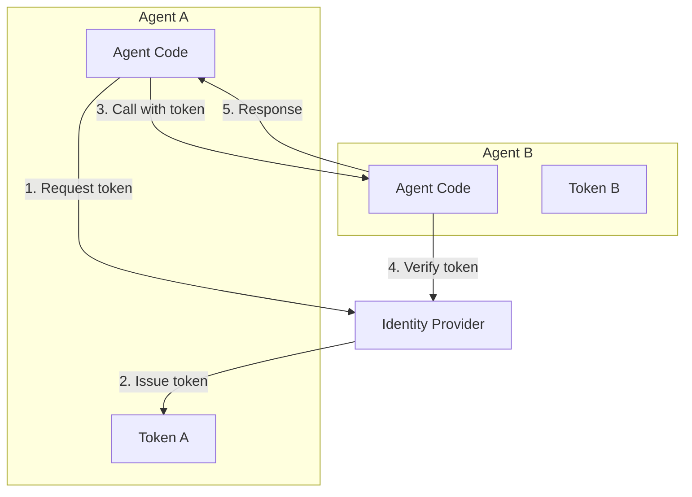

# Agent Identity & A2A

<p style="font-size: 1.1em; color: #666; margin-bottom: 2em;">
Agent authentication and Agent-to-Agent communication.
</p>

---

## Overview

Agent Identity allows agents to:

- **Authenticate**: Unique identity for each agent
- **Communicate**: Secure A2A (Agent-to-Agent) protocol
- **Authorize**: Fine-grained access control between agents



---

## Agent identity

### Create an identity

Each deployed agent automatically receives an identity:

```bash
# The identity is created at deployment
nexus ai agent deploy my-agent

# View the identity
nexus ai agent identity my-agent

# Output:
# Agent ID: agent_abc123
# Service Account: my-agent@agents.nexus.cegid.com
# Scopes: ai:models, tools:rag
```

### Access token

Agents automatically get a JWT token:

```python
from nexus.ai.agents import Agent

class MyAgent(Agent):
    async def process(self, input: str):
        # The token is automatically injected
        token = self.identity.token

        # Token claims
        # {
        #   "sub": "agent_abc123",
        #   "iss": "nexus.cegid.com",
        #   "aud": ["nexus-ai", "nexus-tools"],
        #   "scopes": ["ai:models", "tools:rag"],
        #   "exp": 1705312800
        # }
```

---

## A2A Communication

### Call another agent

```python
from nexus.ai.agents import Agent, AgentClient

class OrchestratorAgent(Agent):
    def __init__(self):
        super().__init__()
        # Client to call other agents
        self.researcher = AgentClient("researcher-agent")
        self.writer = AgentClient("writer-agent")

    async def process(self, topic: str):
        # A2A call - authentication is automatic
        research = await self.researcher.call(
            input=f"Research about {topic}"
        )

        report = await self.writer.call(
            input=f"Write a report based on: {research}"
        )

        return report
```

### A2A Protocol

The A2A protocol uses gRPC with mTLS:

```
┌─────────────────┐         ┌─────────────────┐
│   Agent A       │         │   Agent B       │
│                 │         │                 │
│  1. Get token   │         │                 │
│       ↓         │         │                 │
│  2. Call B      │────────→│  3. Verify      │
│                 │  mTLS   │     token       │
│                 │         │       ↓         │
│  5. Receive     │←────────│  4. Process     │
│     response    │         │     & respond   │
└─────────────────┘         └─────────────────┘
```

### A2A Streaming

```python
async def process(self, input: str):
    # Stream response from another agent
    async for chunk in self.researcher.stream(input=input):
        yield chunk.text
```

---

## Permissions

### Available scopes

| Scope | Description |
|-------|-------------|
| `ai:models` | Access to LLM models |
| `ai:models:gpt4` | Specific access to GPT-4 |
| `tools:rag` | Access to RAG API |
| `tools:code` | Access to Code Execution |
| `tools:web` | Access to Web Search |
| `agents:call` | Can call other agents |
| `agents:call:*` | Can call all agents |
| `agents:call:researcher` | Can call the researcher agent |

### Verify permissions

```python
class MyAgent(Agent):
    async def process(self, input: str, caller: AgentIdentity):
        # Verify who is calling
        if caller.agent_id not in self.config.allow_callers:
            raise PermissionDenied(f"Agent {caller.agent_id} not allowed")

        # Verify caller's scopes
        if "sensitive:data" not in caller.scopes:
            raise PermissionDenied("Missing scope: sensitive:data")

        return await self.do_work(input)
```

---

## Security

All inter-agent communications are encrypted with mTLS. Authorization policies are automatically configured based on agent permissions.

---

## Audit

All A2A communications are logged:

```json
{
  "timestamp": "2025-01-15T10:30:00Z",
  "event": "a2a_call",
  "caller": {
    "agent_id": "agent_abc123",
    "name": "orchestrator-agent"
  },
  "callee": {
    "agent_id": "agent_def456",
    "name": "researcher-agent"
  },
  "action": "call",
  "input_size": 1234,
  "output_size": 5678,
  "latency_ms": 450,
  "status": "success"
}
```

### View audit logs

```bash
nexus ai agent audit my-agent --since 24h

# Filter by caller
nexus ai agent audit my-agent --caller orchestrator-agent
```

---

## Best practices

!!! tip "Principle of least privilege"

    Only grant the strictly necessary scopes to each agent.

!!! warning "Timeouts"

    Configure appropriate timeouts for A2A calls to avoid failure cascades.

    ```python
    self.researcher = AgentClient(
        "researcher-agent",
        timeout=30.0,  # 30 seconds max
        retries=3
    )
    ```

!!! danger "Infinite loops"

    Beware of circular calls between agents. Use depth limits.

    ```python
    async def process(self, input: str, depth: int = 0):
        if depth > 5:
            raise MaxDepthExceeded("Too many nested agent calls")
        # ...
    ```
