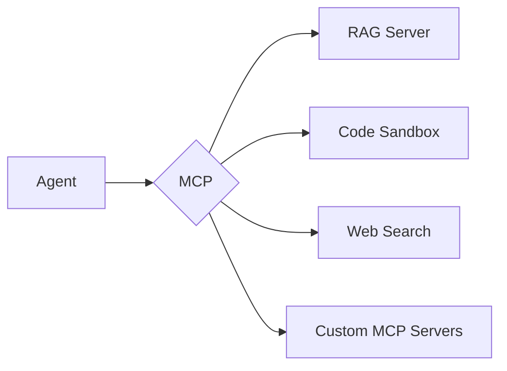

# Agent Tools & MCP

<p style="font-size: 1.1em; color: #666; margin-bottom: 2em;">
Tools to extend your agents' capabilities, including MCP integration.
</p>

---

## Overview

Agents use tools via the [MCP protocol](https://modelcontextprotocol.io) (Model Context Protocol).



Nexus provides pre-configured MCP servers for common use cases.

---

## RAG API

Document search and retrieval to enrich responses.

### Usage

```python
from nexus.ai.tools import RAG

class MyAgent(Agent):
    def __init__(self):
        super().__init__()
        self.rag = RAG(index="documentation")

    @tool
    def search_docs(self, query: str) -> str:
        """Search in the documentation."""
        results = self.rag.search(query, top_k=5)
        return "\n\n".join([
            f"[{r.source}]\n{r.content}"
            for r in results
        ])
```

### Indexing

```python
from nexus.ai.tools import RAGIndexer

indexer = RAGIndexer(index="my-docs")

# Index files
indexer.add_files("./docs/*.md")

# Index text
indexer.add_text(
    content="My content",
    metadata={"source": "manual", "category": "faq"}
)

# Index from URL
indexer.add_url("https://docs.example.com")

# Build the index
indexer.build()
```

---

## Code Execution

Python code execution in a secure sandbox.

### Usage

```python
from nexus.ai.tools import CodeSandbox

class DataAgent(Agent):
    def __init__(self):
        super().__init__()
        self.sandbox = CodeSandbox(
            allowed_packages=["pandas", "numpy", "matplotlib"],
            timeout=30
        )

    @tool
    def execute_python(self, code: str) -> str:
        """Execute Python code."""
        result = self.sandbox.run(code)
        return result.output
```

### Security

The sandbox is isolated with:

- **Network**: No network access by default
- **Filesystem**: Read-only except `/tmp`
- **Resources**: Limited CPU and memory
- **Packages**: Explicit whitelist

### Allowed packages

| Package | Description |
|---------|-------------|
| `pandas` | Data manipulation |
| `numpy` | Numerical computing |
| `matplotlib` | Visualization |
| `seaborn` | Statistical visualization |
| `scikit-learn` | Basic ML |
| `requests` | HTTP (if network enabled) |

---

## Web Search

Web search to get recent information.

### Usage

```python
from nexus.ai.tools import WebSearch

class ResearchAgent(Agent):
    def __init__(self):
        super().__init__()
        self.search = WebSearch()

    @tool
    def search_web(self, query: str) -> str:
        """Search the web."""
        results = self.search.search(query, max_results=5)
        return "\n\n".join([
            f"[{r.title}]({r.url})\n{r.snippet}"
            for r in results
        ])
```

### Web navigation

To extract content from a page:

```python
from nexus.ai.tools import WebBrowser

browser = WebBrowser()

# Get page content
page = browser.get("https://example.com/article")
print(page.text)  # Extracted text content
print(page.links)  # Links on the page

# Screenshot (headless)
screenshot = browser.screenshot("https://example.com")
```

---

## Custom APIs

Integrate your own APIs as tools.

### Declaration

```python
from nexus.ai.tools import api_tool

@api_tool(
    name="get_weather",
    description="Get current weather for a location"
)
async def get_weather(location: str) -> dict:
    """Get weather for a city."""
    async with httpx.AsyncClient() as client:
        response = await client.get(
            f"https://api.weather.com/v1/current",
            params={"location": location}
        )
        return response.json()


class WeatherAgent(Agent):
    tools = [get_weather]
```

### OpenAPI Integration

Generate tools from an OpenAPI spec:

```python
from nexus.ai.tools import from_openapi

# Automatically generate tools
tools = from_openapi("https://api.example.com/openapi.json")

class MyAgent(Agent):
    tools = tools
```

---

## MCP Integration

All tools are exposed via [MCP](https://modelcontextprotocol.io) (Model Context Protocol).

### Cegid MCP Catalog

Pre-configured MCP servers available in the Cegid ecosystem:

| Server | Description |
|--------|-------------|
| `github` | GitHub repositories, issues, PRs |
| `jira` | Jira tickets and projects |
| `confluence` | Confluence pages and spaces |
| `slack` | Slack messages and channels |
| `postgres` | PostgreSQL database queries |
| `filesystem` | File system access (scoped) |

### Custom MCP servers

Register your own MCP server:

```bash
nexus mcp register my-server --url mcp://my-server.internal
```

---

## Best practices

!!! tip "Clear descriptions"

    Tool descriptions are sent to the LLM. Be precise about what each tool does and its parameters.

    ```python
    @tool
    def search_docs(self, query: str, category: str = None) -> str:
        """Search in the internal documentation.

        Args:
            query: The question or keywords to search for.
            category: Optional. Filter by category (api, guide, faq).

        Returns:
            The 5 most relevant documents with their sources.
        """
    ```

!!! warning "Input validation"

    Always validate inputs before executing code or queries.

    ```python
    @tool
    def execute_python(self, code: str) -> str:
        if "import os" in code or "subprocess" in code:
            return "Error: Forbidden imports detected"
        # ...
    ```

!!! danger "Costs"

    Tools can consume a lot of resources. Configure limits to avoid excessive usage.
