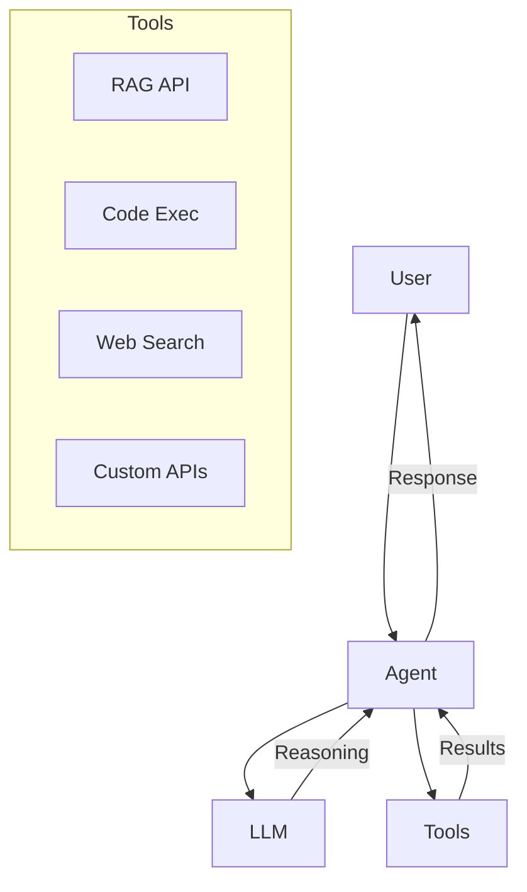

# Agents

<p style="font-size: 1.1em; color: #666; margin-bottom: 2em;">
Create, deploy, and manage AI agents in production.
</p>

---

## What is an Agent?

An agent is a program that uses an LLM to accomplish tasks autonomously. Unlike a simple chatbot, an agent can:

- **Use tools**: Call APIs, execute code, search the web
- **Reason**: Break down a complex problem into steps
- **Iterate**: Correct its errors and refine its responses
- **Collaborate**: Communicate with other agents (A2A)



---

## Nexus Agent Framework

Nexus provides a complete framework for agents:

<div class="grid cards" markdown>

-   :material-file-code:{ .lg .middle } **Templates**

    ---

    Ready-to-use starters for different agent patterns.

    [:octicons-arrow-right-24: View templates](templates.md)

-   :material-server:{ .lg .middle } **Hosting**

    ---

    Managed runtime to run your agents in production.

    [:octicons-arrow-right-24: Deploy](hosting.md)

-   :material-badge-account:{ .lg .middle } **Identity & A2A**

    ---

    Authentication and communication between agents.

    [:octicons-arrow-right-24: Configure](identity.md)

-   :material-wrench:{ .lg .middle } **Tools**

    ---

    Pre-integrated tools: RAG, Code Exec, Web Search.

    [:octicons-arrow-right-24: Explore](tools.md)

</div>

---

## Quick Start

### Create an agent

```bash
# Scaffold a new agent
nexus ai agent new my-assistant --template basic

cd my-assistant
```

Generated structure:

```
my-assistant/
├── agent.py           # Main code
├── config.yaml        # Configuration
├── tools/             # Custom tools
│   └── __init__.py
├── tests/
│   └── test_agent.py
├── Dockerfile
└── README.md
```

### Basic code

```python
# agent.py
from nexus.ai.agents import Agent, tool

class MyAssistant(Agent):
    """A simple assistant."""

    system_prompt = """You are a helpful assistant.
    You can use the available tools to answer questions."""

    @tool
    def search_docs(self, query: str) -> str:
        """Search in the documentation."""
        # Implement search
        return f"Results for: {query}"

    @tool
    def calculate(self, expression: str) -> float:
        """Evaluate a mathematical expression."""
        return eval(expression)  # Simplified for example
```

### Test locally

```bash
# Run the agent in interactive mode
nexus ai agent run

# Or via local API
nexus ai agent serve --port 8080
```

### Deploy

```bash
# Deploy to Nexus
nexus ai agent deploy --env production

# Check status
nexus ai agent status my-assistant
```

---

## Agent patterns

### Conversational

Agent that maintains a conversation context:

```python
class ConversationalAgent(Agent):
    system_prompt = "You are a conversational assistant."

    def __init__(self):
        self.memory = ConversationMemory(max_turns=10)
```

### RAG (Retrieval-Augmented Generation)

Agent that searches in a knowledge base:

```python
class RAGAgent(Agent):
    def __init__(self):
        self.retriever = NexusRetriever(index="docs")

    @tool
    def search(self, query: str) -> str:
        docs = self.retriever.search(query, top_k=5)
        return "\n".join(d.content for d in docs)
```

### ReAct (Reasoning + Acting)

Agent that reasons step by step:

```python
class ReActAgent(Agent):
    system_prompt = """Use the format:
    Thought: think about the problem
    Action: choose a tool
    Observation: observe the result
    ... (repeat)
    Final Answer: give the final answer"""
```

### Multi-agent

Multiple agents collaborating:

```python
class OrchestratorAgent(Agent):
    def __init__(self):
        self.researcher = ResearchAgent()
        self.writer = WriterAgent()

    async def process(self, task: str):
        research = await self.researcher.run(task)
        result = await self.writer.run(research)
        return result
```

---

## Configuration

```yaml
# config.yaml
name: my-assistant
version: 1.0.0

model:
  name: gpt-4o
  temperature: 0.7
  max_tokens: 2000

memory:
  type: conversation
  max_turns: 20

tools:
  - name: search_docs
    enabled: true
  - name: calculate
    enabled: true

hosting:
  replicas: 2
  cpu: 500m
  memory: 512Mi

observability:
  tracing: true
  metrics: true
```

---

## Best practices

!!! tip "System prompts"

    - Be explicit about the role and constraints
    - Include examples of expected behavior
    - Limit capabilities to actual needs

!!! warning "Security"

    - Validate user inputs
    - Limit available tools
    - Log all actions

!!! danger "Costs"

    - Monitor consumed tokens
    - Set loop limits
    - Use caching when possible
