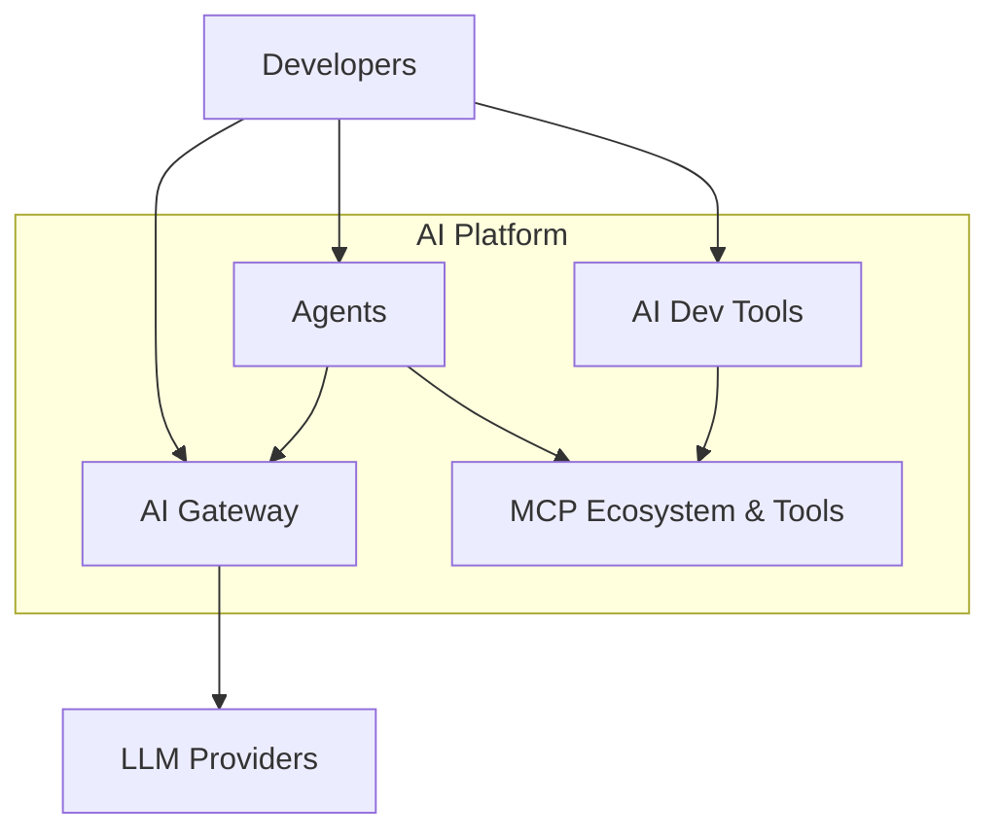

# AI Platform

<p style="font-size: 1.2em; color: #666; margin-bottom: 2em;">
Accessible, governed, and observable AI. Model Access, Agents, and MCP ecosystem.
</p>

---

## Overview

The Nexus AI Platform provides everything teams need to integrate AI into their applications:



---

## Problems solved

| Before Nexus | With Nexus |
|-------------|------------|
| Complex integration with Azure Foundry | Unified proxy, no config |
| Mandatory communication with Cloud team | Self-service |
| API key management per team | No API keys for teams |
| No visibility on costs | Dashboard and alerts |
| Agents developed from scratch | Ready-to-use templates and hosting |

---

## Components

<div class="grid cards" markdown>

-   :material-api:{ .lg .middle } **Model Access**

    ---

    Unified proxy for all LLMs. Built-in governance and observability.

    [:octicons-arrow-right-24: Details](model-access.md)

-   :material-robot:{ .lg .middle } **Agents**

    ---

    Templates, hosting, and identity for AI agents.

    [:octicons-arrow-right-24: Details](agents/index.md)

-   :material-puzzle:{ .lg .middle } **MCP Ecosystem**

    ---

    Catalog of MCP servers to extend agent capabilities.

    [:octicons-arrow-right-24: Details](mcp-ecosystem.md)

-   :material-creation:{ .lg .middle } **Easy Building**

    ---

    No-code interface for non-technical teams.

    [:octicons-arrow-right-24: Details](easy-building.md)

-   :material-hammer-wrench:{ .lg .middle } **AI Dev Tools**

    ---

    Tools for developers: Golden Rules MCP and more.

    [:octicons-arrow-right-24: Details](dev-tools/index.md)

</div>

---

## Quick Start

### Call an LLM

=== "Python SDK"

    ```python
    from nexus.ai import NexusAI

    ai = NexusAI()

    response = ai.chat.completions.create(
        model="gpt-4o",
        messages=[{"role": "user", "content": "Hello!"}]
    )
    print(response.choices[0].message.content)
    ```

=== "OpenAI SDK compatible"

    ```python
    from openai import OpenAI

    # Use Nexus as proxy
    client = OpenAI(
        base_url="https://nexus.internal/ai/v1",
        api_key="unused"  # Auth via Nexus token
    )

    response = client.chat.completions.create(
        model="gpt-4o",
        messages=[{"role": "user", "content": "Hello!"}]
    )
    ```

=== "CLI"

    ```bash
    nexus ai chat "Hello, how are you?"
    nexus ai chat "Explain Kubernetes" --model claude-3-opus
    ```

### Create an agent

```bash
# Scaffold a new agent
nexus ai agent new my-agent --template rag

# Generated structure
my-agent/
├── agent.py
├── config.yaml
├── tools/
├── tests/
└── README.md
```

---

## Available models

| Provider | Models | Use case |
|----------|---------|----------|
| **Azure OpenAI** | GPT-4o, GPT-4-turbo, GPT-3.5-turbo | General, coding |
| **Anthropic** | Claude 3 Opus, Sonnet, Haiku | Analysis, reasoning |
| **Mistral** | Mistral Large, Medium | Cost optimized |
| **Custom** | Internal fine-tuned models | Specific use cases |

---

## Governance

- **Logging**: All requests are logged (prompts, responses, metadata)
- **PII Detection**: Alerts on personal data in prompts
- **Audit trail**: Complete access history

---

## Key metrics

| Metric | Current value |
|----------|-----------------|
| LLM requests / day | 45k |
| Agents in production | 12 |
| Cataloged MCP servers | 23 |
| User teams | 15 |
| Total monthly cost | $12k |
