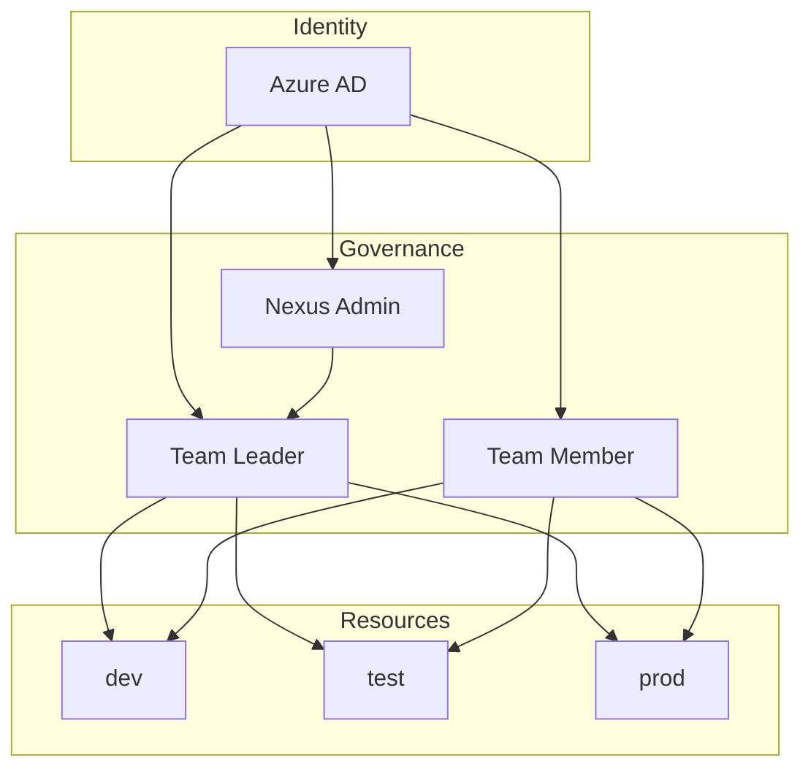
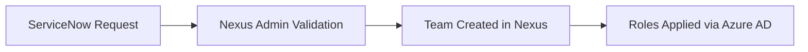

# Identity & Governance

Identity, Teams, and Resource Governance model.

---

## Overview

---

## Identity & Access Management

!!! info "Azure AD as Source of Truth"

    | Principle | Description |
    |-----------|-------------|
    | **Source of Truth** | Azure AD is the single identity source |
    | **Authentication** | SSO mandatory, no local Nexus accounts |
    | **Sync** | Users and application identities synced from Azure AD |

---

## Roles

-   :material-shield-crown:{ .lg .middle } **Nexus Admin**

    ---

    - Create, modify, or archive Teams
    - Appoint or revoke Team Leaders
    - Define global platform rules (default quotas, environments, providers, policies)

-   :material-account-tie:{ .lg .middle } **Team Leader**

    ---

    - Can lead one or multiple Teams
    - Manage Team members
    - Create and administer team-scoped resources
    - Define quotas per environment
    - Responsible for usage, costs, and compliance

-   :material-account:{ .lg .middle } **Team Member**

    ---

    - Access only their Team's resources
    - No governance rights

---

## Team Lifecycle

### Creation (via ServiceNow)

All Team creation goes through **ServiceNow**:

Request includes: name, description, Team Leader(s), environments, initial quotas.

### Team Leader Changes

- All nominations go through ServiceNow
- Validated by Nexus Admin
- Revocation doesn't impact existing resources

---

## Teams as Ownership Unit

Teams are the central unit for:

!!! abstract "Governance"
    Policies and rules

!!! abstract "Security"
    Access control

!!! abstract "Costs"
    Budget and quotas

!!! abstract "Operations"
    Responsibility

!!! info "Key Rule"
    Every official resource belongs to a Team.

---

## Environments

| Environment | Purpose | Icon |
|-------------|---------|------|
| `dev` | Development and experimentation | :material-test-tube: |
| `test` | Integration and validation | :material-checkbox-marked-circle: |
| `prod` | Production workloads | :material-rocket-launch: |

Environments are:

- [x] Logically isolated
- [x] Independently governed
- [x] Subject to specific quotas and rules

!!! warning "Isolation"
    A resource belongs to one environment and never moves.

---

## Resource Scoping

!!! example "User-scoped (Dev only)"

    For individual experimentation and rapid prototyping:

    - Attached to an Azure AD user
    - **Only in `dev`** environment
    - Strictly limited quotas
    - No promotion possible
    - No prod dependencies

    **Examples:** personal AI agent, temporary LLM access, RAG sandbox

!!! success "Team-scoped (Default)"

    All shared resources or resources in `test`/`prod` are **Team-scoped**:

    - Quotas, costs, and responsibilities owned by the Team
    - Required for any production workload

---

## No Promotion Model

!!! danger "Critical Rule"
    There is no automatic promotion or copy mechanism between environments.

| Environment | Purpose |
|-------------|---------|
| `dev` | Exploration |
| `test` / `prod` | Intentional, governed creation |

Resources are **recreated**, never promoted.

---

## Resource Types

| Resource | Scope | Icon |
|----------|-------|------|
| **LLM Model Access** | Per Team, per environment | :material-brain: |
| **Application Registration** | Azure AD based, Team-scoped (except dev) | :material-application: |
| **Agent Hosting** | Attached to Team + environment, strict isolation | :material-robot: |

---

## Design Principles

-   :material-key: **SSO everywhere**

-   :material-account-cog: **Admins create teams, not users**

-   :material-ticket: **ServiceNow as governance entry point**

-   :material-account-group: **Teams own resources**

-   :material-shield-check: **No prod without ownership**

-   :material-refresh: **Recreate, don't promote**

