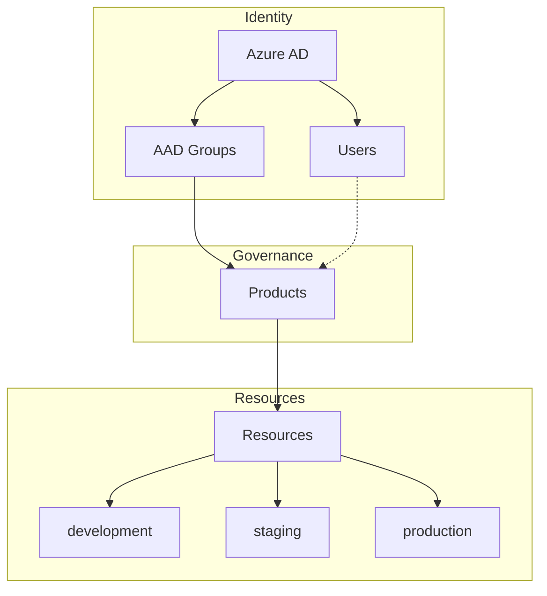

# Identity & Governance

Identity, Products, and Resource Governance model.

---

## Overview

**Access model:**

- **Primary**: Users access Products via Azure AD Groups (`product_aad_groups`)
- **Secondary**: Optional direct membership via `product_members` (admin/member roles) for exceptions or service accounts

---

## Identity & Access Management

!!! info "Azure AD as Source of Truth"

    | Principle | Description |
    |-----------|-------------|
    | **Source of Truth** | Azure AD is the single identity source |
    | **Authentication** | SSO mandatory, no local Nexus accounts |
    | **Sync** | Users and application identities synced from Azure AD |

---

## Roles

### Global Roles (users.role)

-   :material-shield-crown:{ .lg .middle } **Admin**

    ---

    - Create, modify, or archive Products
    - Manage Azure AD group associations
    - Define global platform rules (quotas, environments, policies)

-   :material-account:{ .lg .middle } **User**

    ---

    - Access Products via Azure AD group membership
    - Operate on resources within their Products

!!! info "Optional: Product Members"
    For exceptions, service accounts, or fine-grained access control, users can be added directly to a Product via `product_members` with roles `admin` or `member`. This bypasses Azure AD group membership.

---

## Product Lifecycle

### Azure AD Group Management

- Products are linked to Azure AD groups via `product_aad_groups`
- Users inherit access through their group memberships
- Group membership managed in Azure AD (not in Nexus)

---

## Products as Ownership Unit

Products are the central unit for:

!!! abstract "Governance"
    Policies and rules

!!! abstract "Security"
    Access control via Azure AD

!!! abstract "Costs"
    Budget and quotas

!!! abstract "Operations"
    Responsibility and ownership

!!! info "Key Rule"
    Every official resource belongs to a Product.

---

## Environments

| Environment | Purpose | Icon |
|-------------|---------|------|
| `development` | Development and experimentation | :material-test-tube: |
| `staging` | Integration and validation | :material-checkbox-marked-circle: |
| `production` | Production workloads | :material-rocket-launch: |

Environments are:

- [x] Logically isolated
- [x] Independently governed
- [x] Subject to specific quotas and rules

!!! warning "Isolation"
    A resource belongs to one environment and never moves.

---

## Resource Scoping

!!! example "User-scoped (Dev only)"

    For individual experimentation and rapid prototyping:

    - Attached to an Azure AD user
    - **Only in `development`** environment
    - Strictly limited quotas
    - No promotion possible
    - No prod dependencies

    **Examples:** personal AI agent, temporary LLM access, RAG sandbox

!!! success "Product-scoped (Default)"

    All shared resources or resources in `staging`/`production` are **Product-scoped**:

    - Quotas, costs, and responsibilities owned by the Product
    - Required for any production workload

---

## No Promotion Model

!!! danger "Critical Rule"
    There is no automatic promotion or copy mechanism between environments.

| Environment | Purpose |
|-------------|---------|
| `development` | Exploration |
| `staging` / `production` | Intentional, governed creation |

Resources are **recreated**, never promoted.

---

## Resource Types

| Resource | Scope | Icon |
|----------|-------|------|
| **LLM Model Access** | Per Product, per environment | :material-brain: |
| **Application Registration** | Azure AD based, Product-scoped (except dev) | :material-application: |
| **Agent Hosting** | Attached to Product + environment, strict isolation | :material-robot: |

---

## Design Principles

-   :material-key: **SSO everywhere**

-   :material-account-cog: **Admins create Products, not users**

-   :material-account-group: **Products own resources**

-   :material-shield-check: **No prod without ownership**

-   :material-refresh: **Recreate, don't promote**

