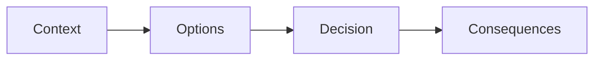

# Architecture

Architecture decisions and technical documentation.

---

## Documentation

-   :material-shield-account:{ .lg .middle } **Identity & Governance**

    ---

    Identity, Teams, and Resource Governance model. Azure AD, roles, environments.

    [:octicons-arrow-right-24: View](governance.md)

-   :material-file-document-check:{ .lg .middle } **ADRs**

    ---

    Architecture Decision Records. History of significant technical decisions.

    [:octicons-arrow-right-24: View](adrs.md)

---

## ADRs (Architecture Decision Records)

An **ADR** documents an important architecture decision with its context, the options considered, and the justification for the final choice.

---

## How to Contribute

!!! note "Propose a Decision"

    1. Copy the [ADR template](../_Contributing/templates/adr.md)
    2. Fill in the sections (context, options, decision, consequences)
    3. Submit a PR
    4. Review by the Architecture committee
    5. Merge = decision accepted

!!! tip "Discuss Architecture"

    Architecture discussions happen in the **weekly committee**:

    - Review pending ADRs and RFCs
    - Align on technical choices
    - Take concrete actions

---

## Related

-   :material-file-document-edit:{ .lg .middle } **ADR Template**

    [:octicons-arrow-right-24: View](../_Contributing/templates/adr.md)

-   :material-file-document-outline:{ .lg .middle } **RFC Template**

    [:octicons-arrow-right-24: View](../_Contributing/templates/rfc.md)

-   :material-account-group:{ .lg .middle } **Team & Committees**

    [:octicons-arrow-right-24: View](../_Team.md)

