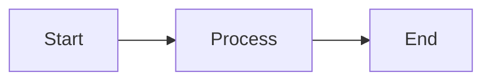

# Style Guide

<p style="font-size: 1.1em; color: #666; margin-bottom: 2em;">
Writing and formatting conventions for Nexus documentation.
</p>

---

## Language

- Technical documentation: **French** or **English** depending on the audience
- Technical terms: Keep in English (API, SDK, CLI, etc.)
- Code: Comments in English

---

## Tone

- **Direct**: Get straight to the point
- **Active**: "Create an application" rather than "An application can be created"
- **Concrete**: Examples rather than theory
- **Respectful**: No unnecessary jargon

---

## Headings

### Hierarchy

```markdown
# Main title (H1)
## Section (H2)
### Subsection (H3)
#### Detail (H4)
```

### Conventions

- Sentence case: `# Model access configuration`
- No period at the end
- Infinitive verbs for actions: `# Create an agent`

---

## Code

### Code blocks

Always specify the language:

````markdown
```python
def hello():
    print("Hello")
```
````

### Shell commands

```bash
# With explanatory comment
nexus app create my-app --team platform
```

### Inline

Use `` `backticks` `` for:

- File names: `config.yaml`
- Commands: `nexus app list`
- Variables: `NEXUS_TOKEN`
- Values: `true`, `false`

---

## Links

### Internal

Use relative paths:

```markdown
[See the roadmap](../_Roadmap.md)
```

### External

```markdown
[OpenTelemetry Documentation](https://opentelemetry.io/docs)
```

---

## Images

### Placement

Store in `docs/assets/images/` with kebab-case names.

### Syntax

```markdown

```

---

## Zensical Components

### Admonitions

```markdown
!!! note "Optional title"
    Note content.

!!! warning
    Be careful with this.

!!! danger
    Do not do this!

!!! tip
    Useful tip.

!!! info
    Additional information.
```

### Tabs

```markdown
=== "Python"

    ```python
    print("Hello")
    ```

=== "TypeScript"

    ```typescript
    console.log("Hello");
    ```
```

### Tables

```markdown
| Column 1 | Column 2 |
|----------|----------|
| Value 1  | Value 2  |
```

### Lists

```markdown
- Item 1
- Item 2
  - Sub-item

1. Step 1
2. Step 2
```

---

## Mermaid Diagrams

```markdown

```

Supported types:

- `graph` / `flowchart`: Flow diagrams
- `sequenceDiagram`: Sequence diagrams
- `erDiagram`: Data models
- `gantt`: Timelines

---

## Review checklist

Before submitting:

- [ ] Spelling and grammar checked
- [ ] Internal links working
- [ ] Code tested and functional
- [ ] Screenshots up to date
- [ ] No sensitive information (tokens, credentials)
- [ ] Local preview validated
