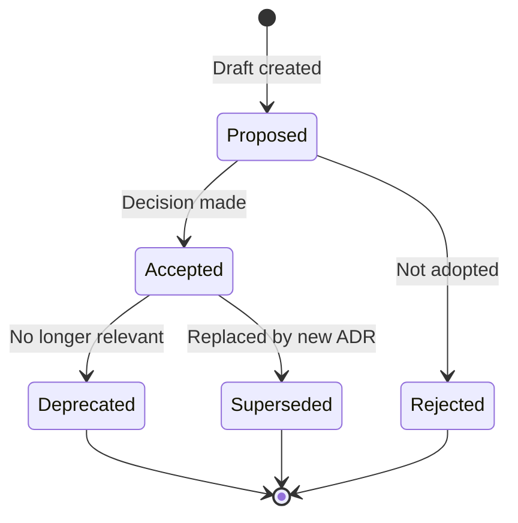

# ADR Template

Use this template to document Architecture Decision Records (ADRs). ADRs capture important architectural decisions made along with their context and consequences.

---

## When to Write an ADR

Write an ADR when:

- Making a significant technology choice
- Selecting an architectural pattern
- Deciding between competing approaches
- Establishing a new convention or standard
- Changing a previous architectural decision

---

## Template

Copy the template below to create your ADR:

```markdown
# ADR-XXXX: [Title]

| Field | Value |
|-------|-------|
| **ADR ID** | ADR-XXXX |
| **Status** | Proposed / Accepted / Deprecated / Superseded |
| **Date** | YYYY-MM-DD |
| **Author(s)** | [Name(s)] |
| **Deciders** | [Who made or approved this decision] |
| **Consulted** | [Who was consulted] |
| **Informed** | [Who needs to know about this decision] |

---

## Context

[Describe the context and background that led to this decision. What is the issue that we're seeing that is motivating this decision or change?]

### Problem Statement

[What specific problem are we trying to solve?]

### Constraints

[What constraints exist that limit our options?]

- Constraint 1
- Constraint 2

### Assumptions

[What assumptions are we making?]

- Assumption 1
- Assumption 2

---

## Decision

[Clearly state the decision that was made]

**We will [decision].**

### Rationale

[Explain why this decision was made. What factors were most important?]

---

## Options Considered

### Option 1: [Name] (Chosen)

[Description of the chosen option]

**Pros:**

- Pro 1
- Pro 2

**Cons:**

- Con 1
- Con 2

### Option 2: [Name]

[Description of alternative option]

**Pros:**

- Pro 1
- Pro 2

**Cons:**

- Con 1
- Con 2

### Option 3: [Name]

[Repeat for each option considered]

---

## Consequences

### Positive

[What positive outcomes result from this decision?]

- Positive consequence 1
- Positive consequence 2

### Negative

[What negative outcomes or trade-offs result from this decision?]

- Negative consequence 1
- Negative consequence 2

### Risks

[What risks does this decision introduce?]

| Risk | Likelihood | Impact | Mitigation |
|------|------------|--------|------------|
| Risk 1 | Low/Med/High | Low/Med/High | [Mitigation strategy] |

---

## Implementation

[High-level implementation notes, if applicable]

### Action Items

- [ ] Action item 1
- [ ] Action item 2

### Timeline

[When will this be implemented?]

---

## Related Decisions

[Link to related ADRs]

- [ADR-XXXX: Related decision](link)

---

## References

[Links to supporting materials]

- [Reference 1](link)
- [Reference 2](link)

---

## Notes

[Any additional notes or context]
```

---

## ADR Lifecycle



### Status Definitions

| Status | Description |
|--------|-------------|
| **Proposed** | Under discussion, not yet decided |
| **Accepted** | Decision has been made and is in effect |
| **Deprecated** | Decision is no longer relevant |
| **Superseded** | Replaced by a newer ADR (link to new one) |
| **Rejected** | Proposed but not accepted |

---

## File Naming Convention

ADRs should be stored in `docs/architecture/decisions/` with the following naming convention:

```
adr-XXXX-short-title.md
```

Examples:

- `adr-0001-use-postgresql-for-persistence.md`
- `adr-0002-adopt-event-driven-architecture.md`
- `adr-0003-service-mesh-selection.md`

---

## ADR Index

Maintain an index of all ADRs:

| ID | Title | Status | Date |
|----|-------|--------|------|
| ADR-0001 | [Title](link) | Accepted | YYYY-MM-DD |
| ADR-0002 | [Title](link) | Accepted | YYYY-MM-DD |

---

## Tips for Writing Effective ADRs

### Keep It Concise

- Focus on the decision and its immediate context
- Avoid turning ADRs into design documents
- Link to detailed designs rather than embedding them

### Capture the "Why"

- Future readers need to understand the reasoning
- Document constraints that influenced the decision
- Record trade-offs that were considered

### Be Specific

- Name concrete technologies, patterns, or approaches
- Avoid vague language like "use best practices"
- Include measurable criteria when possible

### Update When Superseded

- Don't delete old ADRs
- Mark them as superseded with a link to the new decision
- This preserves historical context

---

## Example ADR

```markdown
# ADR-0001: Use PostgreSQL for Primary Data Storage

| Field | Value |
|-------|-------|
| **ADR ID** | ADR-0001 |
| **Status** | Accepted |
| **Date** | 2025-01-15 |
| **Author(s)** | Jane Smith |
| **Deciders** | Platform Architecture Team |

---

## Context

We need to select a primary relational database for the platform's
transactional data. The database will store user data, application
state, and configuration.

### Constraints

- Must be open source or have reasonable licensing
- Must support horizontal read scaling
- Must have managed service options in major clouds

---

## Decision

**We will use PostgreSQL as our primary relational database.**

### Rationale

PostgreSQL offers the best combination of features, ecosystem
support, and operational maturity for our needs. Its strong
consistency guarantees, rich feature set, and excellent cloud
provider support make it the clear choice.

---

## Options Considered

### Option 1: PostgreSQL (Chosen)

**Pros:** Mature, feature-rich, excellent cloud support, strong community
**Cons:** Horizontal write scaling requires additional tooling

### Option 2: MySQL

**Pros:** Widely adopted, good cloud support
**Cons:** Fewer advanced features, licensing concerns with Oracle

### Option 3: CockroachDB

**Pros:** Native horizontal scaling, PostgreSQL compatible
**Cons:** Less mature, smaller ecosystem, higher cost

---

## Consequences

### Positive

- Well-understood technology with extensive documentation
- Easy to hire engineers with PostgreSQL experience
- Rich ecosystem of tools and extensions

### Negative

- Horizontal write scaling requires sharding solution
- Some advanced features locked to enterprise versions

---

## References

- [PostgreSQL Documentation](https://www.postgresql.org/docs/)
- [Cloud Provider Comparison](internal-link)
```

---

## Related Documents

- [RFC Template](rfc.md)
- [Architecture Overview](../_Architecture/overview.md)
