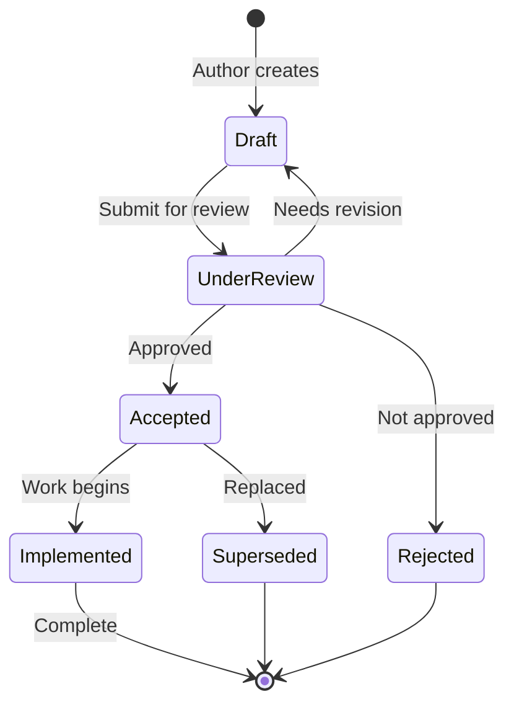

# RFC Template

Use this template to propose significant changes to the Nexus Platform. RFCs (Request for Comments) ensure that major decisions are well-documented, reviewed, and agreed upon before implementation.

---

## When to Write an RFC

Write an RFC when proposing:

- New platform capabilities or services
- Significant architectural changes
- Changes affecting multiple teams
- New processes or policies
- Deprecation of existing functionality

---

## Template

Copy the template below to create your RFC:

```markdown
# RFC-XXXX: [Title]

| Field | Value |
|-------|-------|
| **RFC ID** | RFC-XXXX |
| **Title** | [Descriptive title] |
| **Author(s)** | [Name(s) and team(s)] |
| **Status** | Draft / Under Review / Accepted / Rejected / Superseded |
| **Created** | YYYY-MM-DD |
| **Last Updated** | YYYY-MM-DD |
| **Reviewers** | [List of reviewers] |

---

## Summary

[One paragraph summary of the proposal. What is being proposed and why?]

---

## Motivation

### Problem Statement

[Describe the problem this RFC addresses. What pain points exist today?]

### Goals

[What are the specific goals of this proposal?]

- Goal 1
- Goal 2
- Goal 3

### Non-Goals

[What is explicitly out of scope for this proposal?]

- Non-goal 1
- Non-goal 2

---

## Proposal

### Overview

[High-level description of the proposed solution]

### Detailed Design

[Detailed technical description of the proposal. Include:]

- Architecture changes
- API designs
- Data models
- Integration points

### User Experience

[How will users interact with this change?]

### Examples

[Provide concrete examples of how the proposal would work]

---

## Alternatives Considered

### Alternative 1: [Name]

[Description of alternative approach]

**Pros:**
- Pro 1
- Pro 2

**Cons:**
- Con 1
- Con 2

**Why not chosen:** [Explanation]

### Alternative 2: [Name]

[Repeat for each alternative considered]

---

## Dependencies

### Upstream Dependencies

[What this proposal depends on]

| Dependency | Type | Status |
|------------|------|--------|
| [Dependency 1] | [Hard/Soft] | [Status] |

### Downstream Impact

[What depends on or is affected by this proposal]

| System/Team | Impact |
|-------------|--------|
| [System 1] | [Impact description] |

---

## Security Considerations

[Address security implications of this proposal]

- Authentication/authorization changes
- Data handling implications
- Attack surface changes
- Compliance considerations

---

## Operational Considerations

### Rollout Plan

[How will this be deployed?]

| Phase | Description | Duration |
|-------|-------------|----------|
| Phase 1 | [Description] | [Duration] |
| Phase 2 | [Description] | [Duration] |

### Rollback Plan

[How can this be rolled back if issues arise?]

### Monitoring

[How will success be measured? What metrics and alerts are needed?]

---

## Migration

[If applicable, how will existing users/systems migrate?]

### Migration Path

1. Step 1
2. Step 2
3. Step 3

### Backward Compatibility

[Is this backward compatible? If not, what breaks?]

---

## Open Questions

[List any unresolved questions that need input]

1. Question 1
2. Question 2

---

## Timeline

| Milestone | Target Date |
|-----------|-------------|
| RFC Approval | YYYY-MM-DD |
| Implementation Start | YYYY-MM-DD |
| Alpha/Beta | YYYY-MM-DD |
| GA | YYYY-MM-DD |

---

## References

- [Link to related documentation]
- [Link to prior art or inspiration]
- [Link to related RFCs]

---

## Appendix

[Any additional supporting material]
```

---

## RFC Lifecycle



### Status Definitions

| Status | Description |
|--------|-------------|
| **Draft** | Initial creation, not ready for review |
| **Under Review** | Open for feedback and discussion |
| **Accepted** | Approved for implementation |
| **Rejected** | Not approved (with rationale documented) |
| **Implemented** | Implementation complete |
| **Superseded** | Replaced by a newer RFC |

---

## Review Process

### Submitting for Review

1. Create the RFC document in `docs/rfcs/`
2. Open a pull request
3. Add reviewers based on affected areas
4. Announce in `#platform-rfcs` Slack channel

### Review Criteria

Reviewers evaluate:

- [ ] Problem is clearly defined
- [ ] Solution addresses the problem
- [ ] Alternatives were considered
- [ ] Security implications addressed
- [ ] Operational impact understood
- [ ] Timeline is realistic

### Approval

RFCs require approval from:

- At least 2 peer reviewers
- Technical lead of affected area(s)
- Platform Architecture team (for architectural changes)

---

## Tips for Writing Effective RFCs

1. **Start with the problem**: Clearly articulate the pain point
2. **Be specific**: Vague proposals are hard to evaluate
3. **Show your work**: Document alternatives you considered
4. **Consider operations**: How will this be maintained?
5. **Get early feedback**: Discuss informally before writing
6. **Keep it updated**: Reflect changes based on feedback

---

## Related Documents

- [ADR Template](adr.md)
- [Architecture Overview](../_Architecture/overview.md)
- [Contributing Guide](../_Contributing/index.md)
