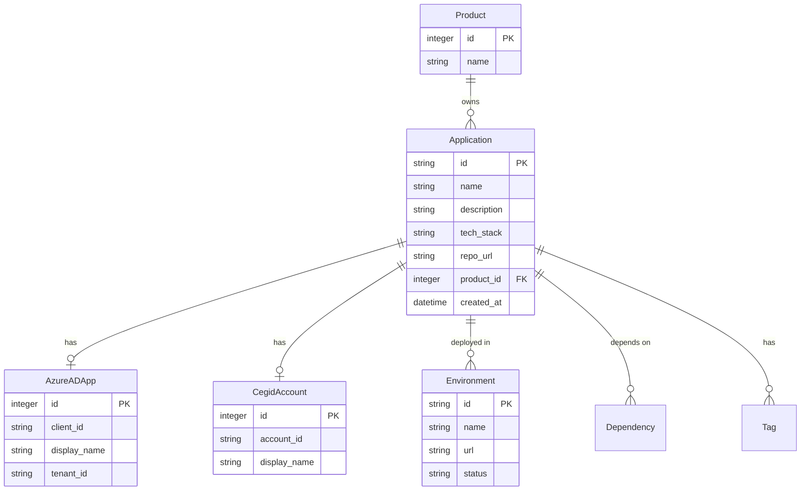

# Application Registry

<p style="font-size: 1.1em; color: #666; margin-bottom: 2em;">
Centralized catalog of all applications in the organization.
</p>

---

## Purpose

The Application Registry is the **source of truth** for all applications. It answers:

- What applications exist?
- Which product owns them?
- What are the Azure AD and Cegid Account identities?
- What is the tech stack?
- What environments are deployed?

---

## Data Model



!!! info "Relationship with Products"
    Applications belong to a **Product** (from the [Data Model](../_Architecture/data-model.md)). Product ownership defines access control via Azure AD groups.

### Required Fields

| Field | Description | Example |
|-------|-------------|---------|
| `name` | Unique application name | `payment-service` |
| `product_id` | Owner product | `business-os` |
| `repo_url` | Repository URL | `github.com/org/payment-service` |
| `tech_stack` | Technologies used | `["python", "fastapi", "postgres"]` |

### Optional Fields

| Field | Description |
|-------|-------------|
| `description` | Short description |
| `azure_ad_app` | Azure AD App registration |
| `cegid_account` | Cegid Account identity |
| `docs_url` | Link to documentation |
| `runbook_url` | Link to runbook |
| `tier` | Criticality (tier-1, tier-2, tier-3) |
| `tags` | Free-form tags for filtering |

---

## Usage

### Create an Application

=== "CLI"

    ```bash
    nexus app create payment-service \
      --product business-os \
      --repo github.com/org/payment-service \
      --stack python,fastapi,postgres \
      --tier tier-1
    ```

=== "SDK"

    ```python
    from nexus import NexusClient

    client = NexusClient()
    app = client.apps.create(
        name="payment-service",
        product_id="business-os",
        repo_url="github.com/org/payment-service",
        tech_stack=["python", "fastapi", "postgres"],
        tier="tier-1"
    )
    ```

### Search Applications

=== "CLI"

    ```bash
    # By product
    nexus app list --product business-os

    # By technology
    nexus app list --stack python

    # By tag
    nexus app list --tag critical
    ```

=== "SDK"

    ```python
    # By product
    apps = client.apps.list(product_id="business-os")

    # By technology
    apps = client.apps.list(tech_stack="python")

    # Full-text search
    apps = client.apps.search("payment")
    ```

### Update an Application

=== "CLI"

    ```bash
    nexus app update payment-service \
      --description "Payment service v2" \
      --add-tag pci-dss
    ```

=== "SDK"

    ```python
    client.apps.update(
        "payment-service",
        description="Payment service v2",
        tags=["pci-dss"]
    )
    ```

---

## Integrations

### CI/CD

The registry integrates automatically with GitHub Actions via the `nexus/register-deployment` action.

### Observability

Registry metadata is propagated to:

- **Dynatrace**: Dashboards per application/product

### Security

- **Ownership**: Every application has an identified owner
- **Compliance**: Tags for PCI, GDPR applications, etc.
- **Audit**: History of modifications

---

## Best Practices

!!! tip "Naming Conventions"

    - Use the format `{domain}-{function}`: `payment-service`, `user-api`
    - Avoid team prefixes: `platform-payment` :material-close:
    - No underscores: `payment_service` :material-close:

!!! warning "Maintenance"

    - Update the registry when stack changes
    - Archive deprecated applications (don't delete)
    - Verify ownership quarterly

---

## Example Response

```json
{
  "id": "app_abc123",
  "name": "payment-service",
  "product": {
    "id": "prod_xyz",
    "name": "business-os"
  },
  "azure_ad_app": {
    "client_id": "12345678-abcd-1234-abcd-123456789012",
    "display_name": "payment-service-app",
    "tenant_id": "cegid.onmicrosoft.com"
  },
  "cegid_account": {
    "account_id": "acc_payment_001",
    "display_name": "Payment Service"
  },
  "tech_stack": ["python", "fastapi", "postgres"],
  "tier": "tier-1",
  "environments": [
    {
      "name": "production",
      "url": "https://payment.cegid.cloud",
      "status": "healthy"
    }
  ],
  "created_at": "2025-01-15T10:00:00Z"
}
```
