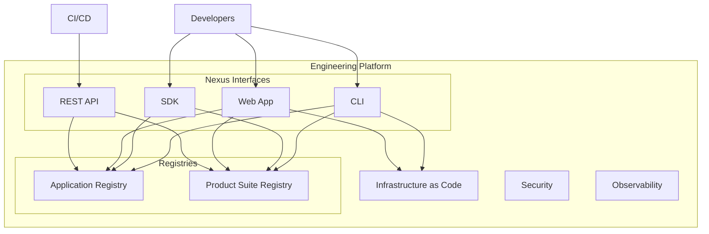

# Engineering Platform

<p style="font-size: 1.2em; color: #666; margin-bottom: 2em;">
Infrastructure at the service of developers. Interfaces, IaC, registries, security, and observability.
</p>

---

## Overview

The Engineering Platform provides the technical foundation for all development teams:



---

## Components

<div class="grid cards" markdown>

-   :material-api:{ .lg .middle } **Nexus Interfaces**

    ---

    REST API, multi-language SDKs, CLI, Web App. Generated via Fern.

    [:octicons-arrow-right-24: Details](interfaces/index.md)

-   :material-cloud-cog:{ .lg .middle } **Infrastructure as Code**

    ---

    Pre-packaged Terraform templates. Validated by Cloud & Architects.

    [:octicons-arrow-right-24: Details](infrastructure.md)

-   :material-database:{ .lg .middle } **Registries**

    ---

    Application Registry and Product Suite Registry.

    [:octicons-arrow-right-24: Application Registry](application-registry.md) · [:octicons-arrow-right-24: Product Suite Registry](service-registry.md)

-   :material-shield-lock:{ .lg .middle } **Security**

    ---

    Authentication, authorization, secrets management.

    [:octicons-arrow-right-24: Details](security/index.md)

-   :material-chart-line:{ .lg .middle } **Observability**

    ---

    Monitoring, logging, and tracing with Dynatrace.

    [:octicons-arrow-right-24: Details](observability/index.md)

</div>

---

## Principles

### Single Source of Truth

Each application and service is registered once. Metadata is automatically propagated to:

- CI/CD (labels, tags)
- Observability (dashboards, alerts)
- Security (ownership, compliance)
- Costs (chargeback)

### Convention over Configuration

The platform makes default choices. Examples:

| Aspect | Convention |
|--------|------------|
| Naming | `{team}-{app}-{env}` |
| K8s Labels | `app.kubernetes.io/*` |
| Metrics | Mandatory RED metrics |
| Logs | Structured JSON format |

### Self-service

Teams can:

- [x] Create an application in the registry
- [x] Register a service
- [x] Provision infrastructure
- [x] Generate credentials

Without tickets. Within guardrail limits.

---

## Quick Start

=== "CLI"

    ```bash
    # Install CLI
    brew install nexus-cli

    # Login
    nexus auth login

    # Create an application
    nexus app create my-app --team platform

    # List services
    nexus service list
    ```

=== "SDK (Python)"

    ```python
    from nexus import NexusClient

    client = NexusClient()

    # Create an application
    app = client.apps.create(
        name="my-app",
        team="platform",
        tech_stack=["python", "fastapi"]
    )

    # List services
    services = client.services.list()
    ```

=== "API"

    ```bash
    # Create an application
    curl -X POST https://nexus.internal/api/v1/apps \
      -H "Authorization: Bearer $TOKEN" \
      -d '{"name": "my-app", "team": "platform"}'

    # List services
    curl https://nexus.internal/api/v1/services \
      -H "Authorization: Bearer $TOKEN"
    ```
