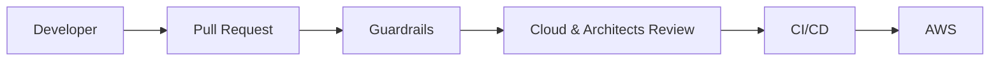

# Infrastructure as Code

Terraform templates with built-in guardrails.

---

## Overview

Infrastructure is provisioned using **Terraform templates** validated by the Cloud team and Architects.

---

## How it Works

1. **Use a template** - Pick from approved Terraform modules
2. **Open a PR** - Guardrails run automatically
3. **Review** - Cloud team & Architects validate
4. **Deploy** - CI/CD applies the infrastructure

---

## Guardrails

Automated checks on every PR:

| Check | Description |
|-------|-------------|
| **Security** | No public access, encryption enabled |
| **Compliance** | Required tags (owner, cost-center) |
| **Cost** | Budget limits enforced |
| **Best practices** | Naming conventions, resource sizing |

---

## Validation

| Validator | Role |
|-----------|------|
| **Cloud Team** | Technical review |
| **Architects** | Architecture compliance |
