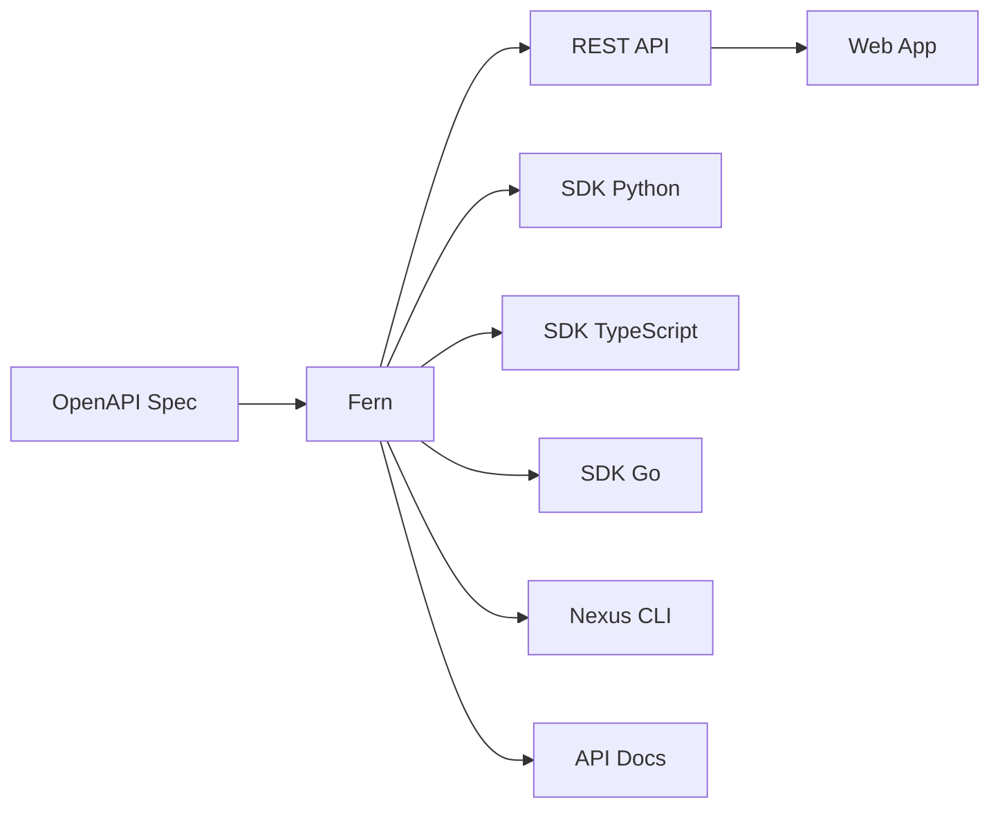

# Nexus Interfaces

<p style="font-size: 1.1em; color: #666; margin-bottom: 2em;">
Four interfaces, one source of truth. API, SDK, CLI, and Web App.
</p>

---

## Philosophy

Nexus follows the **API-first** principle: every feature is first an API. The SDK and CLI are automatically generated from the OpenAPI specification via [Fern](https://buildwithfern.com).



### Benefits

| Aspect | Benefit |
|--------|---------|
| **Consistency** | All interfaces have the same behavior |
| **Documentation** | Always up-to-date (generated) |
| **Tests** | Automatically generated |
| **Evolution** | One API change = all interfaces updated |

---

## Which Interface to Use?

| Use case | Recommended Interface |
|----------|----------------------|
| Visual exploration, self-service | Web App |
| Manual operations, debugging | CLI |
| Application code, scripts | SDK |
| CI/CD, automation | API |

---

## The Four Interfaces

<div class="grid cards" markdown>

-   :material-api:{ .lg .middle } **REST API**

    ---

    The reference programmatic interface. Base for all others.

    [:octicons-arrow-right-24: API Documentation](api.md)

-   :material-package-variant:{ .lg .middle } **SDK**

    ---

    Typed clients for Python, TypeScript, and Go.

    [:octicons-arrow-right-24: SDK Documentation](sdk.md)

-   :material-console:{ .lg .middle } **CLI**

    ---

    Command-line interface for daily operations.

    [:octicons-arrow-right-24: CLI Documentation](cli.md)

-   :material-application:{ .lg .middle } **Web App**

    ---

    Self-service portal for visual exploration.

    [:octicons-arrow-right-24: Web App Documentation](webapp.md)

</div>

---

## Authentication

All interfaces use the same authentication system:

### Personal Token

```bash
# Get a token via CLI
nexus auth login

# Token is stored in ~/.nexus/config.yaml
```

### Service Account

For automation (CI/CD), use a service account:

```bash
# Create a service account
nexus auth create-sa my-ci --scopes apps:read,services:write

# Use the token
export NEXUS_TOKEN=<token>
nexus app list
```

### In Code

=== "Python"

    ```python
    from nexus import NexusClient

    # Auto-detects NEXUS_TOKEN or ~/.nexus/config.yaml
    client = NexusClient()

    # Or explicitly
    client = NexusClient(token="...")
    ```

=== "TypeScript"

    ```typescript
    import { NexusClient } from '@nexus/sdk';

    const client = new NexusClient({
      token: process.env.NEXUS_TOKEN
    });
    ```

---

## Rate Limiting

| Type | Limit | Window |
|------|-------|--------|
| Personal token | 1000 req | 1 min |
| Service account | 5000 req | 1 min |
| Per IP (unauth) | 100 req | 1 min |

Response headers:

```
X-RateLimit-Limit: 1000
X-RateLimit-Remaining: 950
X-RateLimit-Reset: 1705312800
```

---

## Versioning

The API is versioned via path:

```
https://nexus.internal/api/v1/apps
https://nexus.internal/api/v2/apps  # future
```

### Deprecation Policy

1. **Announcement**: 6 months before end of support
2. **Warning header**: `Deprecation: true` in responses
3. **Sunset**: Removal of old version

---

## Errors

Standardized format for all interfaces:

```json
{
  "error": {
    "code": "RESOURCE_NOT_FOUND",
    "message": "Application 'my-app' not found",
    "details": {
      "resource_type": "application",
      "resource_id": "my-app"
    },
    "request_id": "req_abc123"
  }
}
```

### Common Error Codes

| Code | HTTP | Description |
|------|------|-------------|
| `VALIDATION_ERROR` | 400 | Invalid parameters |
| `UNAUTHORIZED` | 401 | Missing or invalid token |
| `FORBIDDEN` | 403 | Insufficient permissions |
| `RESOURCE_NOT_FOUND` | 404 | Resource doesn't exist |
| `RATE_LIMITED` | 429 | Too many requests |
| `INTERNAL_ERROR` | 500 | Server error |
