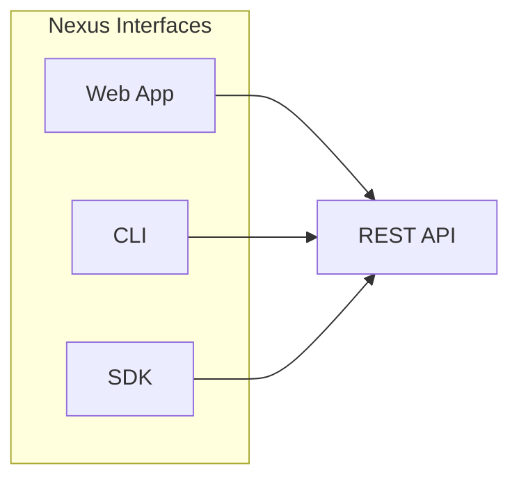

# Web App

<p style="font-size: 1.1em; color: #666; margin-bottom: 2em;">
Self-service portal for platform users.
</p>

---

## Overview

The Nexus Web App provides a graphical interface for teams to interact with the platform without writing code. It complements the CLI and SDK for users who prefer a visual approach.



---

## Features

### Application Management

- Browse and search the application catalog
- Register new applications with guided forms
- View application details, dependencies, and metrics
- Manage tags, ownership, and metadata

### Service Discovery

- Visual service topology map
- Real-time health status dashboard
- Endpoint browser with filtering
- Service dependency graph

### Infrastructure

- Self-service resource provisioning
- Terraform plan preview and approval
- Resource status and cost tracking
- Environment comparison view

### AI Platform

- Model catalog browser
- Usage dashboards and quota monitoring
- Agent deployment wizard
- MCP server configuration

---

## Access

```
Production : https://nexus.internal
Staging    : https://nexus-staging.internal
```

### Authentication

The Web App uses SSO with your corporate identity provider:

1. Navigate to the Web App URL
2. You'll be redirected to the identity provider
3. After authentication, you're returned to the app

---

## Key Pages

### Dashboard

The home dashboard provides:

- Quick actions for common tasks
- Recent activity feed
- Team's applications and services
- System status and announcements

### Application Registry

| View | Description |
|------|-------------|
| **Catalog** | Browse all applications with filters |
| **My Apps** | Applications owned by your team |
| **Dependencies** | Dependency graph visualization |
| **Metrics** | Application health and usage metrics |

### Service Map

Interactive visualization of service topology:

- Click nodes to see service details
- Filter by team, environment, or status
- Highlight communication paths
- Export as diagram

### Infrastructure Console

Self-service infrastructure management:

- **Provision**: Create resources from templates
- **Status**: Monitor provisioning progress
- **Resources**: List and manage existing resources
- **Cost**: View usage and estimated costs

---

## Permissions

The Web App respects RBAC permissions:

| Role | Capabilities |
|------|--------------|
| **Viewer** | Browse catalog, view details |
| **Developer** | Create apps, provision resources |
| **Admin** | Manage team settings, delete resources |
| **Platform Admin** | Full platform administration |

---

## Keyboard Shortcuts

| Shortcut | Action |
|----------|--------|
| `⌘ + K` | Quick search |
| `⌘ + N` | New application |
| `⌘ + /` | Show all shortcuts |
| `G then A` | Go to Applications |
| `G then S` | Go to Services |
| `G then I` | Go to Infrastructure |

---

## Mobile Support

The Web App is responsive and works on mobile devices for:

- Viewing application and service status
- Checking alerts and notifications
- Approving infrastructure changes
- Basic troubleshooting

For full functionality, use a desktop browser.

---

## Integration with Other Interfaces

The Web App generates CLI commands and SDK code snippets:

### Copy as CLI

When viewing a resource, click **Copy as CLI** to get the equivalent command:

```bash
nexus app get my-service --format yaml
```

### Copy as SDK

Get SDK code for programmatic access:

=== "Python"

    ```python
    app = client.apps.get("my-service")
    ```

=== "TypeScript"

    ```typescript
    const app = await client.apps.get('my-service');
    ```

---

## Feedback

Use the feedback button in the app footer to:

- Report bugs
- Request features
- Suggest improvements

All feedback is reviewed by the Platform team.
