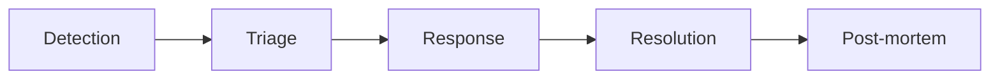

# Incident Management

How we handle incidents.

---

## Process

---

## Severities

| Severity | Impact | Response SLA |
|----------|--------|-------------|
| **SEV1** | Production down | 15 min |
| **SEV2** | Major degradation | 30 min |
| **SEV3** | Minor degradation | 2h |
| **SEV4** | Limited impact | 1 day |

---

## Tools

| Tool | Purpose |
|------|---------|
| :material-github: GitHub Issues | Declare & track incidents |

---

## Post-mortem

Required within 48h for SEV1/SEV2:

- What happened?
- Root cause
- Action items to prevent recurrence
