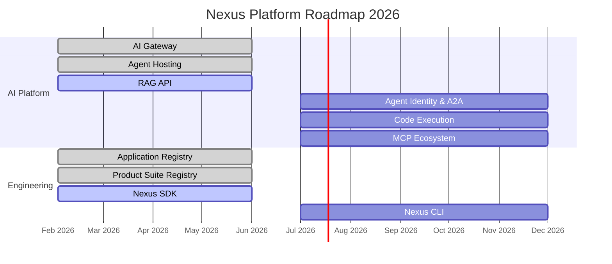

# Roadmap

Strategic vision and delivery timeline for the Nexus Platform.

---

## Timeline

---

## Phase 1 - S1 2026

!!! success "Foundation & Core Services"

    Establishing the foundational infrastructure and core AI capabilities.

-   :material-api:{ .lg .middle } **AI Gateway**

    ---

    Unified gateway for all LLM providers with governance, caching, and observability.

    [:octicons-arrow-right-24: Documentation](_AI-Platform/_Foundations/_1-model-access.md)

-   :material-robot:{ .lg .middle } **Agent Hosting**

    ---

    Managed runtime for AI agents with automatic scaling and lifecycle management.

    [:octicons-arrow-right-24: Documentation](_AI-Platform/agents/_1-hosting.md)

-   :material-database-search:{ .lg .middle } **RAG API**

    ---

    Retrieval-Augmented Generation API for knowledge-enhanced AI applications.

    [:octicons-arrow-right-24: Coming soon](#)

-   :material-server:{ .lg .middle } **Product Suite Registry**

    ---

    Centralized registry for Cegid client environments and product instances.

    [:octicons-arrow-right-24: Documentation](_Engineering/service-registry.md)

-   :material-application:{ .lg .middle } **Application Registry**

    ---

    Centralized catalog for all applications with metadata and ownership tracking.

    [:octicons-arrow-right-24: Documentation](_Engineering/application-registry.md)

-   :material-language-python:{ .lg .middle } **Nexus SDK**

    ---

    Python, TypeScript, and Go SDKs for seamless platform integration.

    [:octicons-arrow-right-24: Documentation](_Engineering/interfaces/sdk.md)

---

## Phase 2 - S2 2026

!!! warning "Advanced Capabilities"

    Expanding the platform with advanced agent features and developer tooling.

-   :material-shield-account:{ .lg .middle } **Agent Identity & A2A**

    ---

    Secure identity management and Agent-to-Agent communication protocols.

    [:octicons-arrow-right-24: Documentation](_AI-Platform/agents/_2-identity.md)

-   :material-code-braces:{ .lg .middle } **Code Execution**

    ---

    Secure sandboxed code execution for AI agents with support for multiple runtimes.

    [:octicons-arrow-right-24: Coming soon](#)

-   :material-puzzle:{ .lg .middle } **MCP Ecosystem**

    ---

    Model Context Protocol server catalog for extended agent capabilities.

    [:octicons-arrow-right-24: Documentation](_AI-Platform/_Foundations/_2-mcp-ecosystem.md)

-   :material-console:{ .lg .middle } **Nexus CLI**

    ---

    Command-line interface for developers to interact with all platform services.

    [:octicons-arrow-right-24: Documentation](_Engineering/interfaces/cli.md)

---

## Projects

!!! info "Pilot Projects"

    Initial projects that will leverage the Nexus Platform capabilities.

| Project | Description | Phase | Status |
|---------|-------------|-------|--------|
| **My HR Cockpit Agent** | HR assistant for employee self-service | Phase 1 | :material-progress-clock: Ongoing |
| **Learning Agent** | Personalized learning and training companion | Phase 1 | :material-clock-outline: Planned |
| **Lettrage Agent** | Automated accounting reconciliation assistant | Phase 1 | :material-progress-clock: Ongoing |

---

## Related Documentation

- [Architecture](_Architecture/index.md)
- [AI Platform](_AI-Platform/index.md)
- [Engineering Platform](_Engineering/index.md)
