# Team

Organization, squads, and ways of working.

---

## Squads

-   :material-robot:{ .lg .middle } **KMB Team**

    ---

    RAG API and Agent development.

    **Focus areas:**

    - RAG API implementation
    - Agent development & templates
    - AI tooling

-   :material-server:{ .lg .middle } **Pulse OS Team**

    ---

    Agent hosting infrastructure.

    **Focus areas:**

    - Agent Hosting platform
    - Agent Identity & A2A
    - Runtime management

-   :material-account-group:{ .lg .middle } **Canadian Team**

    ---

    Product Suite Registry.

    **Focus areas:**

    - Product Suite Registry
    - Client environments management
    - Instance discovery

-   :material-car:{ .lg .middle } **Notilus Car Team**

    ---

    Registry and Engineering Platform.

    **Focus areas:**

    - Product Suite Registry
    - Engineering Platform
    - Platform tooling

---

## Transverse

### Architects

| Name | Role |
|------|------|
| **Damien Géranton** | Platform Architect |
| **François Panard** | Platform Architect |

### Cloud

| Area | Owner |
|------|-------|
| Cloud Infrastructure | *TBD* |

---

## Tools & Infrastructure

| Category | Tool |
|----------|------|
| **Code** | GitHub |
| **Documentation** | GitHub |
| **Main Cloud Provider** | Amazon Web Services (AWS) |
| **Identity Provider** | Azure AD |

---

## Ways of Working

### Committees

!!! info "Weekly Architecture Committee"

    **Frequency:** Once per week

    **Purpose:**

    - Discuss ADRs (Architecture Decision Records)
    - Review RFCs (Request for Comments)
    - Align on architecture decisions

    **Rule:** Every meeting must result in actions. If no action is taken, the meeting is considered unproductive.

### Sprints

| Aspect | Detail |
|--------|--------|
| **Duration** | 3 weeks (adjustable per team) |
| **Planning** | Sprint planning meeting at start |
| **Demo** | Demo meeting at end of sprint |

```mermaid
gantt
    title Sprint Cycle
    dateFormat X
    axisFormat %s

    section Sprint
    Planning     :0, 1
    Development  :1, 19
    Demo         :19, 21
```

---

## Contact

| Channel | Purpose |
|---------|---------|
| :material-github: [nexus-docs](https://github.com/cegid/nexus-docs) | Documentation |
